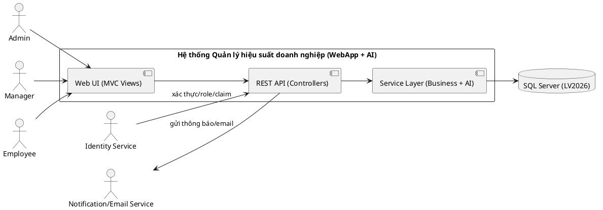
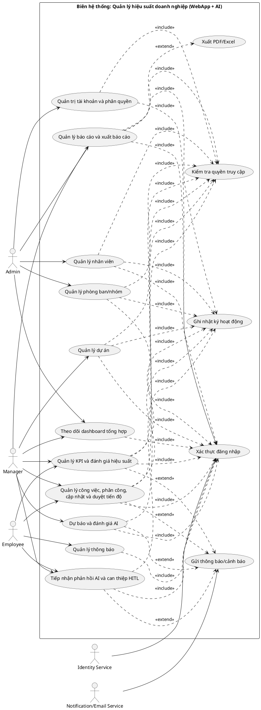
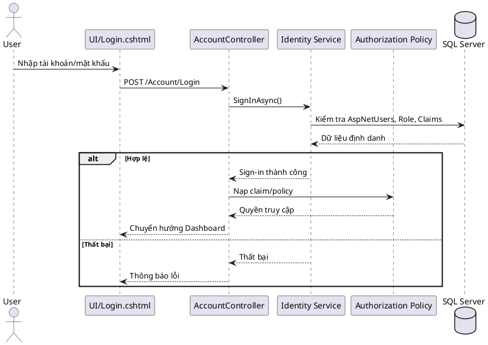

# BÁO CÁO LUẬN VĂN (19/05/2026)

**Tên đề tài (gợi ý):** Xây dựng hệ thống quản lý hiệu suất doanh nghiệp dựa trên KPI kết hợp mô-đun AI hỗ trợ ra quyết định (WebApp + AI)

**Dự án tham chiếu:** LV2026 (ASP.NET Core 8.0 MVC + API, SQL Server, ASP.NET Identity, EF Core, AI nội bộ)

> **Ghi chú chung (để đối chiếu nhanh):**
> - Ma trận vai trò/quyền: `LuanVan/LuanVan/Contracts/Roles.cs`, `LuanVan/LuanVan/Contracts/Permissions.cs`, cấu hình policy ở `LuanVan/LuanVan/Program.cs`.
> - Tài liệu chức năng theo vai trò: `Chitietchucnanghethong.md`.
> - Use case/Sequence/ER rút gọn: `usecase_overview.md`, `usecase_functional.md`, `sequence_full.md`, `class_er_compact.md`.
> - Thiết kế/mapping DB thực tế: `LuanVan/LuanVan/Data/AppDbContext.cs` (+ snapshot migration).
> - Báo cáo kiểm tra luồng nghiệp vụ: `WORKFLOW_ANALYSIS_REPORT.md`.

---

## CHƯƠNG 1. GIỚI THIỆU

### 1.1 Đặt vấn đề
> **Ghi chú:** Viết theo bối cảnh “quản lý hiệu suất doanh nghiệp” + nhu cầu số hóa quy trình dự án/công việc/KPI và minh bạch đánh giá. Có thể tham khảo phần tác nhân/chức năng trong `Chitietchucnanghethong.md`.

Trong nhiều doanh nghiệp, hoạt động quản lý hiệu suất (performance management) thường gắn với các câu hỏi: nhân sự đang làm gì, tiến độ dự án ra sao, kết quả đóng góp có đo lường được không, và ai cần được hỗ trợ/điều phối kịp thời. Thực tế vận hành cho thấy nếu quy trình chỉ dựa trên báo cáo thủ công (Excel/Email) thì dễ phát sinh các vấn đề: dữ liệu phân tán, cập nhật chậm, khó truy vết lịch sử, đánh giá thiếu nhất quán giữa các phòng ban, và khó phát hiện rủi ro trễ hạn.

Đề tài tập trung xây dựng một hệ thống WebApp quản trị hiệu suất dựa trên KPI, tích hợp quản lý dự án – công việc – phân công – tiến độ, đồng thời bổ sung mô-đun AI nội bộ nhằm:
- Dự báo rủi ro trễ hạn công việc, hỗ trợ cảnh báo sớm.
- Phân loại hiệu suất nhân sự dựa trên các chỉ báo thực thi.
- Gợi ý nguồn lực/điều phối dựa trên dữ liệu nghiệp vụ.

### 1.2 Lịch sử giải quyết vấn đề
> **Ghi chú:** Có thể mô tả theo 2 lớp: (1) lịch sử “cách doanh nghiệp giải quyết trước đây” (thủ công → bán tự động → hệ thống), (2) lịch sử “tiến hóa trong dự án LV2026”. Đối chiếu thêm `vandecuaduan.md` và `WORKFLOW_ANALYSIS_REPORT.md`.

**(1) Góc nhìn nghiệp vụ:**
- Giai đoạn 1: Theo dõi dự án/công việc bằng trao đổi thủ công (Excel/Email/Chat), KPI tính rời rạc theo phòng ban.
- Giai đoạn 2: Sử dụng phần mềm quản lý công việc nhưng KPI vẫn tách rời, thiếu liên kết giữa tiến độ thực tế và đánh giá.
- Giai đoạn 3: Tích hợp quản trị dự án – công việc – tiến độ – KPI trên một nền tảng, bổ sung cảnh báo và gợi ý dựa trên dữ liệu.

**(2) Góc nhìn triển khai dự án LV2026:**
- Xây dựng backend theo mô hình MVC + API, dữ liệu lưu trên SQL Server.
- Chuẩn hóa phân quyền theo **Role + Claim (Permission)**; thiết lập `FallbackPolicy` yêu cầu đăng nhập cho hầu hết endpoint; policy được tạo tự động từ danh sách quyền.
- Hoàn thiện các module: nhân sự, phòng ban/nhóm, dự án, công việc/tiến độ, KPI, báo cáo, thông báo, nhật ký.
- Tích hợp mô-đun AI nội bộ (Linear Regression, Random Forest) qua service layer; có lưu lịch sử dự báo/đánh giá/feedback.

### 1.3 Mục tiêu nghiên cứu
> **Ghi chú:** Mục tiêu nên gắn chặt vào phạm vi triển khai được trong hệ thống (không viết vượt). Đối chiếu danh sách module trong `Chitietchucnanghethong.md`.

**Mục tiêu tổng quát:**
- Xây dựng hệ thống WebApp hỗ trợ quản lý hiệu suất doanh nghiệp dựa trên KPI, liên kết trực tiếp với dữ liệu dự án – công việc – tiến độ và bổ sung AI hỗ trợ ra quyết định.

**Mục tiêu cụ thể:**
- Thiết kế và triển khai cơ chế quản lý tài khoản, vai trò và quyền chi tiết theo claim.
- Xây dựng module quản lý nhân sự, phòng ban, nhóm và kỹ năng.
- Xây dựng module quản lý dự án, công việc, phân công và theo dõi/duyệt tiến độ.
- Xây dựng module KPI (danh mục KPI, gán KPI, tính KPI theo kỳ, xem KPI cá nhân/đội nhóm).
- Xây dựng module báo cáo (lưu nháp – nộp – duyệt – xuất PDF/Excel) và dashboard tổng hợp.
- Tích hợp AI nội bộ để dự báo/đánh giá và ghi nhận phản hồi (HITL).

### 1.4 Phạm vi và đối tượng nghiên cứu
> **Ghi chú:** Mô tả rõ “đối tượng” (quy trình, dữ liệu, người dùng), và “phạm vi” (WebApp + AI nội bộ, không tách microservice). Đối chiếu phần “AI nội bộ” trong `Chitietchucnanghethong.md`.

**Đối tượng nghiên cứu:**
- Quy trình quản lý hiệu suất theo KPI trong môi trường doanh nghiệp, bao gồm quản lý nhân sự, dự án/công việc, báo cáo và đánh giá.
- Dữ liệu nghiệp vụ (nhân sự, tổ chức, dự án, công việc, tiến độ, KPI, báo cáo) và cách tích hợp AI vào quy trình điều hành.

**Phạm vi nghiên cứu:**
- Ứng dụng Web (ASP.NET Core MVC) và hệ thống API nội bộ.
- CSDL SQL Server (LV2026).
- Mô-đun AI chạy nội bộ trong service layer (không triển khai thành hệ thống AI độc lập).
- Phân quyền theo Role + Claim; người dùng gồm Admin/Manager/Employee.

### 1.5 Nội dung nghiên cứu
> **Ghi chú:** Tóm tắt nội dung theo các chương và các module chính.

Nội dung bao gồm: cơ sở lý thuyết KPI và quản lý hiệu suất; nền tảng công nghệ (ASP.NET Core, EF Core, SQL Server, Identity); phân tích và thiết kế hệ thống (use case, sequence, kiến trúc); thiết kế CSDL; kết quả triển khai các chức năng; đánh giá và hướng phát triển.

### 1.6 Những đóng góp chính của đề tài
> **Ghi chú:** Liệt kê đóng góp theo 2 nhóm: (1) nghiệp vụ/hệ thống, (2) kỹ thuật/công nghệ. Đối chiếu `Permissions.cs`, `Program.cs`, và các module AI trong `LuanVan/LuanVan/Services/`.

- Đề xuất và triển khai mô hình **quản lý hiệu suất liên thông**: dự án → công việc → tiến độ → KPI → dashboard/báo cáo.
- Thiết kế cơ chế phân quyền theo **Role + Permission Claim** linh hoạt, có bộ quyền mặc định theo vai trò và có thể mở rộng.
- Tích hợp AI nội bộ để dự báo rủi ro trễ hạn và phân loại hiệu suất nhân sự; lưu lịch sử dự báo/đánh giá/feedback phục vụ minh bạch mô hình.
- Tổ chức dữ liệu theo mô hình quan hệ, có nhật ký hoạt động và luồng phê duyệt cho các nghiệp vụ nhạy cảm.

### 1.7 Kế hoạch thực hiện
> **Ghi chú:** Bạn có thể sửa lại mốc thời gian cho đúng thực tế triển khai của bạn.

- **Tuần 1–2:** Khảo sát bài toán, thu thập yêu cầu; thống nhất tác nhân, quyền và module.
- **Tuần 3–4:** Thiết kế use case/sequence/ERD; thiết kế kiến trúc hệ thống.
- **Tuần 5–7:** Xây dựng CSDL và các module lõi (nhân sự, dự án, công việc, phân công, tiến độ).
- **Tuần 8–9:** Xây dựng KPI, dashboard, báo cáo, thông báo và nhật ký.
- **Tuần 10–11:** Tích hợp AI nội bộ, đánh giá mô hình và HITL.
- **Tuần 12:** Kiểm thử, hoàn thiện báo cáo luận văn và chuẩn bị demo.

### 1.8 Bố cục quyển luận văn
> **Ghi chú:** Tóm tắt bố cục theo Chương 1–6 và phụ lục.

Luận văn gồm 6 chương: giới thiệu; cơ sở lý thuyết và công nghệ; phân tích & thiết kế hệ thống; thiết kế CSDL; kết quả xây dựng & đánh giá; tổng kết & hướng phát triển. Cuối luận văn có tài liệu tham khảo và phụ lục (mô tả API, ma trận quyền, bảng dữ liệu mẫu).

---

## CHƯƠNG 2. CƠ SỞ LÝ THUYẾT VÀ CÔNG NGHỆ SỬ DỤNG

### 2.1 Quản lý hiệu suất doanh nghiệp
> **Ghi chú:** Nên trích thêm tài liệu học thuật/HRM nếu cần (Armstrong, Aguinis, Balanced Scorecard…). Phần này liên hệ sang module KPI và dashboard.

Quản lý hiệu suất doanh nghiệp là quá trình thiết lập mục tiêu, theo dõi thực hiện, đo lường kết quả và cải tiến liên tục nhằm đảm bảo tổ chức đạt được mục tiêu chiến lược. Trong hệ thống LV2026, quản lý hiệu suất được “đưa vào vận hành” thông qua dữ liệu thực thi công việc (task progress), kết quả KPI theo kỳ, và báo cáo tổng hợp.

### 2.2 Chỉ số KPI
> **Ghi chú:** Liên hệ trực tiếp các bảng/đối tượng: `DANHMUCKPI`, `KETQUAKPI`, `KETQUAKPI_TONG`, `KPI_XEPLOAI` (xem mapping trong `AppDbContext`).

KPI (Key Performance Indicator) là chỉ số đo lường các yếu tố quan trọng phản ánh mức độ hoàn thành mục tiêu. Trong hệ thống:
- KPI được quản lý theo danh mục (loại KPI, trọng số).
- KPI được gán theo nhiều phạm vi: nhân viên/nhóm/phòng ban/dự án.
- Kết quả KPI được tính theo kỳ (tháng/năm), lưu vào bảng kết quả để truy vấn, xếp hạng và tổng hợp dashboard.

### 2.3 Trí tuệ nhân tạo trong quản lý hiệu suất
> **Ghi chú:** Dự án thể hiện AI là **module nội bộ** trong biên hệ thống, không phải tác nhân ngoài; đối chiếu `Chitietchucnanghethong.md` (mục 3.1).

AI được dùng như lớp hỗ trợ ra quyết định: dự báo sớm rủi ro, phân loại hiệu suất và gợi ý điều phối. Dữ liệu AI trong LV2026 lấy từ nguồn nghiệp vụ (công việc, tiến độ, KPI, phân công), sau đó được chuẩn hóa thành đặc trưng (features) và đưa vào mô hình. Kết quả dự báo/đánh giá/feedback được lưu để:
- Minh bạch hóa quyết định (truy xuất lịch sử dự báo).
- Đánh giá chất lượng mô hình theo kỳ.
- Ghi nhận phản hồi người dùng và can thiệp HITL.

### 2.4 Linear Regression
> **Ghi chú:** Liên hệ service: `TaskDelayLinearRegressionService.cs` và luồng dự báo trễ hạn trong `sequence_full.md`.

Hồi quy tuyến tính (Linear Regression) mô hình hóa mối quan hệ tuyến tính giữa biến đầu vào $x$ và đầu ra $y$.

Mô hình cơ bản:
$$y = \beta_0 + \beta_1 x_1 + \beta_2 x_2 + \cdots + \beta_p x_p + \epsilon$$

Trong bối cảnh dự án, Linear Regression có thể dùng để ước lượng **số ngày trễ dự kiến** hoặc một giá trị rủi ro liên tục dựa trên đặc trưng của công việc (độ khó, mức ưu tiên, tiến độ hiện tại, lịch sử hoàn thành…).

### 2.5 Random Forest
> **Ghi chú:** Liên hệ service: `EmployeePerformanceRandomForestService.cs` và chức năng phân loại hiệu suất.

Random Forest là mô hình ensemble gồm nhiều cây quyết định. Đầu ra được tổng hợp bằng voting (phân loại) hoặc trung bình (hồi quy). Random Forest phù hợp khi dữ liệu có quan hệ phi tuyến và nhiều đặc trưng, giúp tăng độ ổn định so với một cây đơn lẻ.

Trong dự án, Random Forest được sử dụng để phân loại hiệu suất nhân sự theo nhãn (ví dụ: Xuất sắc/Tốt/Trung bình/Yếu) dựa trên các chỉ báo như: số task hoàn thành, task trễ hạn, tỷ lệ đúng hạn, điểm KPI, xu hướng tiến độ.

### 2.6 SQL Server
> **Ghi chú:** DB được cố định `InitialCatalog = LV2026` trong `Program.cs`. Dữ liệu nghiệp vụ + Identity đều lưu chung SQL Server.

SQL Server đóng vai trò kho dữ liệu trung tâm, đảm bảo tính toàn vẹn và hỗ trợ truy vấn tổng hợp cho dashboard/KPI/báo cáo. Các bảng chính gồm nhóm tổ chức – nhân sự, dự án – công việc – tiến độ, KPI, báo cáo, thông báo, nhật ký và nhóm bảng AI.

### 2.7 C#
> **Ghi chú:** Dự án .NET 8.0, tổ chức theo controllers/services/models.

C# là ngôn ngữ chính để xây dựng backend, triển khai logic nghiệp vụ, phân quyền, xử lý dữ liệu, và triển khai lớp service cho AI.

### 2.8 ASP.NET Core MVC
> **Ghi chú:** Có Portal (UI) và API controllers. Xem `LuanVan/LuanVan/Controllers/PortalController.cs` và các controller trong `Controllers/Api/`.

ASP.NET Core MVC dùng để xây dựng giao diện (Razor Views) và điều phối điều hướng theo quyền. Song song đó, các API controller cung cấp endpoint cho UI gọi AJAX/Fetch để thao tác dữ liệu.

### 2.9 Entity Framework Core
> **Ghi chú:** Mapping bảng được định nghĩa trong `AppDbContext.cs`; snapshot migration thể hiện schema thực tế.

EF Core hỗ trợ ORM, quản lý truy vấn, mapping quan hệ, migration, và kiểm soát transaction/SaveChanges. Dự án tận dụng mapping chi tiết để bám theo các bảng hiện có (nhiều tên bảng/column dạng viết hoa).

### 2.10 ASP.NET Identity và phân quyền
> **Ghi chú:** Vai trò `Admin/Manager/Employee` trong `Roles.cs`. Danh sách permission claim trong `Permissions.cs`. Policy cấu hình trong `Program.cs`.

Hệ thống dùng ASP.NET Identity để:
- Xác thực đăng nhập bằng cookie.
- Quản lý user/role/claim.
- Áp dụng policy authorization theo claim (Permission).

Điểm chính:
- `FallbackPolicy` yêu cầu người dùng đăng nhập cho hầu hết endpoint.
- Mỗi permission có một policy cùng tên; Admin được quyền mặc định toàn bộ.
- Bộ claim mặc định theo role được “seed” tự động khi app chạy.

### 2.11 HTML, CSS, JavaScript, Bootstrap
> **Ghi chú:** UI là Razor Views + Bootstrap + JS, phù hợp xây dựng dashboard và màn hình quản trị nhanh.

HTML/CSS/JS tạo giao diện và tương tác người dùng; Bootstrap cung cấp layout, modal, bảng, form và hỗ trợ responsive.

### 2.12 AJAX, JQuery và REST API
> **Ghi chú:** UI gọi các endpoint trong `Controllers/Api/*Controller.cs`.

Hệ thống sử dụng mô hình REST API, giao tiếp qua JSON; UI gửi request để tải danh sách/chi tiết, tạo/sửa/xóa bản ghi, và hiển thị dashboard thời gian thực.

### 2.13 Python và Scikit-learn
> **Ghi chú:** Python/Scikit-learn phù hợp cho huấn luyện mô hình; trong LV2026 mô hình được tích hợp ở mức service nội bộ (có thể huấn luyện ngoài, sau đó nạp tham số/phiên bản vào hệ thống).

Python và Scikit-learn là hệ sinh thái mạnh để xử lý dữ liệu và xây dựng mô hình ML (Linear Regression, Random Forest). Trong định hướng triển khai, có thể dùng Python để huấn luyện/đánh giá, sau đó đồng bộ phiên bản mô hình và kết quả vào hệ thống (bảng mô hình AI, bảng đánh giá run, feature store, v.v.).

---

## CHƯƠNG 3. PHÂN TÍCH VÀ THIẾT KẾ HỆ THỐNG

### 3.1 Mô tả tổng quan hệ thống
> **Ghi chú:** Tác nhân và chức năng tổng quan trong `usecase_overview.md` và `Chitietchucnanghethong.md`.

Hệ thống LV2026 là một WebApp quản lý hiệu suất doanh nghiệp, gồm các vai trò:
- **Admin:** quản trị hệ thống/tài khoản/phân quyền, giám sát tổng quan.
- **Manager:** điều phối dự án/công việc, phê duyệt tiến độ, vận hành KPI và báo cáo.
- **Employee:** cập nhật tiến độ phần việc được giao, xem KPI cá nhân, nhận thông báo và phản hồi AI.

Các thành phần ngoài hệ thống:
- Dịch vụ Identity (ASP.NET Identity) phục vụ xác thực/role/claim.
- Dịch vụ Notification/Email (qua `EmailService`) phục vụ thông báo.
- SQL Server Database lưu dữ liệu nghiệp vụ.

### 3.2 Yêu cầu chức năng
> **Ghi chú:** Bảng chức năng theo vai trò trong `Chitietchucnanghethong.md`. Các cụm use case trong `usecase_functional.md`.

**Nhóm chức năng chính:**
1) Quản trị hệ thống & tài khoản: đăng nhập/đăng xuất, quản lý tài khoản, role/claim, cấu hình hệ thống.
2) Nhân sự & tổ chức: nhân viên, phòng ban, nhóm, kỹ năng, hồ sơ cá nhân, yêu cầu cập nhật hồ sơ.
3) Dự án & công việc: dự án, công việc, phân công NV/nhóm/phòng ban, cập nhật tiến độ, duyệt/từ chối tiến độ.
4) KPI & đánh giá: danh mục KPI, gán KPI, tính KPI theo kỳ, xem KPI cá nhân/đội nhóm, xếp hạng.
5) Báo cáo & dashboard: tạo/lưu nháp/nộp báo cáo, duyệt/từ chối, export PDF/Excel, dashboard tổng hợp.
6) AI: dự báo rủi ro, phân loại hiệu suất, xem hiệu năng mô hình, feedback và HITL.
7) Thông báo & nhật ký: trung tâm thông báo, audit log hoạt động.

### 3.3 Yêu cầu phi chức năng
> **Ghi chú:** Có thể đối chiếu cấu hình cookie/policy/exception handler trong `Program.cs`.

- **Bảo mật:** xác thực cookie; phân quyền theo policy; API trả 401/403 thay vì redirect.
- **Toàn vẹn dữ liệu:** ràng buộc khóa ngoại; lưu lịch sử và nhật ký hoạt động.
- **Hiệu năng:** truy vấn có phân trang; dùng cache (MemoryCache) cho một số dữ liệu/AI; hạn chế xử lý nặng ở phía UI.
- **Khả dụng & giám sát:** xử lý lỗi server thống nhất; trace id trong phản hồi lỗi (theo thiết kế ApiResponse).
- **Dễ mở rộng:** permission claim mở rộng được mà không phá cấu trúc role; module AI có thể nâng cấp/tách dịch vụ sau.
- **Tính dùng được (usability):** giao diện dashboard, modal thao tác nhanh, bộ lọc và chi tiết dạng drawer.

### 3.4 Mô hình phân cấp chức năng BFD
> **Ghi chú:** Đây là cây chức năng do luận văn tổng hợp; bạn có thể điều chỉnh tên nhánh để khớp cách bạn trình bày.

**BFD (dạng cây):**
- (0) Hệ thống quản lý hiệu suất doanh nghiệp (WebApp + AI)
  - (1) Quản trị hệ thống
    - (1.1) Đăng nhập/đăng xuất, đổi mật khẩu
    - (1.2) Quản lý tài khoản
    - (1.3) Quản lý vai trò và quyền (role/claim)
    - (1.4) Cấu hình hệ thống
  - (2) Quản lý tổ chức – nhân sự
    - (2.1) Nhân viên
    - (2.2) Phòng ban
    - (2.3) Nhóm và thành viên
    - (2.4) Kỹ năng
    - (2.5) Hồ sơ cá nhân + yêu cầu cập nhật
  - (3) Quản lý dự án – công việc
    - (3.1) Dự án
    - (3.2) Công việc
    - (3.3) Phân công (NV/Nhóm/PB)
    - (3.4) Tiến độ + duyệt tiến độ
    - (3.5) Tài liệu & bình luận (theo công việc)
  - (4) KPI – đánh giá
    - (4.1) Danh mục KPI
    - (4.2) Gán KPI theo phạm vi
    - (4.3) Tính KPI theo kỳ
    - (4.4) Xem KPI cá nhân/đội nhóm + xếp hạng
  - (5) Báo cáo – dashboard
    - (5.1) Dashboard tổng hợp
    - (5.2) Lập/Nộp/Duyệt báo cáo
    - (5.3) Xuất PDF/Excel
  - (6) AI hỗ trợ ra quyết định
    - (6.1) Dự báo rủi ro trễ hạn
    - (6.2) Phân loại hiệu suất
    - (6.3) Đánh giá mô hình
    - (6.4) Feedback + HITL
  - (7) Thông báo – nhật ký
    - (7.1) Thông báo
    - (7.2) Nhật ký hoạt động

### 3.5 Biểu đồ ngữ cảnh hệ thống
> **Ghi chú:** Có thể vẽ lại bằng hình trong báo cáo chính thức; dưới đây là dạng PlantUML để bạn render.



### 3.6 Biểu đồ Use-case tổng quát
> **Ghi chú:** Dùng trực tiếp từ `usecase_overview.md`.



### 3.7 Biểu đồ Use-case theo tác nhân
> **Ghi chú:** Có thể dùng cụm sơ đồ trong `usecase_functional.md`. Trong báo cáo, bạn có thể tách riêng cho Admin/Manager/Employee (mỗi sơ đồ 1 trang).

**Tóm tắt theo vai trò:**
- **Admin:** quản trị tài khoản/role/claim; quản lý nhân sự/tổ chức; giám sát dashboard; quản trị cấu hình và báo cáo.
- **Manager:** quản lý dự án/công việc, phân công và duyệt tiến độ; vận hành KPI; tạo/nộp/duyệt báo cáo; dùng AI để dự báo/gợi ý.
- **Employee:** xem dự án/công việc trong phạm vi; cập nhật tiến độ cá nhân; xem KPI cá nhân; gửi feedback AI; nhận thông báo.

### 3.8 Đặc tả Use-case
> **Ghi chú:** Phần này nên chọn 5–8 use case tiêu biểu; dưới đây là mẫu điền theo đúng các module đã có.

**UC01 – Đăng nhập hệ thống**
- **Actor:** Admin/Manager/Employee
- **Tiền điều kiện:** Tài khoản tồn tại, chưa bị khóa.
- **Luồng chính:** Nhập username/password → Identity xác thực → hệ thống tạo cookie session → chuyển Dashboard.
- **Ngoại lệ:** Sai mật khẩu / tài khoản bị khóa.

**UC02 – Tạo dự án**
- **Actor:** Admin/Manager
- **Quyền:** `Projects.Create`.
- **Luồng chính:** Mở form → nhập tên/mô tả/ngày/trạng thái → lưu → hệ thống tạo dự án và liên kết phòng ban.

**UC03 – Tạo công việc + phân công**
- **Actor:** Admin/Manager
- **Quyền:** `Tasks.Create`, `Tasks.Assign`.
- **Luồng chính:** Nhập thông tin task → lưu → gán NV/nhóm/phòng ban → gửi thông báo phân công.
- **Ngoại lệ:** Dự án không hợp lệ; phân công trùng; nhân viên không hoạt động.

**UC04 – Cập nhật tiến độ công việc**
- **Actor:** Employee
- **Quyền:** `Tasks.Edit` (kèm kiểm tra scope nghiệp vụ).
- **Luồng chính:** Mở task được giao → nhập % + ghi chú → gửi cập nhật → lưu tiến độ với trạng thái **Chờ duyệt**.

**UC05 – Duyệt/Từ chối tiến độ**
- **Actor:** Manager/Admin
- **Quyền:** `Tasks.Approve`.
- **Luồng chính:** Xem danh sách chờ duyệt → approve/reject → hệ thống cập nhật `TrangThaiPheDuyet`, ghi người duyệt và thời điểm.

**UC06 – Tính KPI theo kỳ**
- **Actor:** Manager/Admin
- **Quyền:** `Kpi.Evaluate` hoặc `Kpi.Manage`.
- **Luồng chính:** Chọn tháng/năm/phạm vi → hệ thống tổng hợp dữ liệu → tính điểm → lưu `KETQUAKPI`/`KETQUAKPI_TONG`.

**UC07 – Dự báo rủi ro trễ hạn (AI)**
- **Actor:** Manager/Admin
- **Quyền:** `Ai.ViewForecast`.
- **Luồng chính:** Chọn phạm vi (task/nhân viên/dự án) → build feature → chạy mô hình → lưu lịch sử dự báo + cảnh báo nếu rủi ro cao.

**UC08 – Lập và nộp báo cáo**
- **Actor:** Manager/Employee
- **Quyền:** `Reports.Create`, `Reports.Submit`.
- **Luồng chính:** Tạo báo cáo → lưu nháp → nộp → trạng thái chuyển “Chờ duyệt” → thông báo người duyệt.

### 3.9 Biểu đồ tuần tự
> **Ghi chú:** Có thể dùng trực tiếp các sơ đồ trong `sequence_full.md` hoặc `LuanVan/sequence.md`.

**Ví dụ – Đăng nhập + phân quyền:**


### 3.10 Kiến trúc hệ thống
> **Ghi chú:** Service và hosted service nằm trong `LuanVan/LuanVan/Services/`. Chính sách bảo mật nằm ở `Program.cs`.

**Kiến trúc lớp (gợi ý trình bày):**
- **Presentation Layer:** Razor Views (Portal) + JS/AJAX.
- **API Layer:** `Controllers/Api/*Controller.cs` cung cấp REST endpoints.
- **Service Layer:** nghiệp vụ (KPI/Audit/Notification) và AI (feature builder, prediction, evaluation).
- **Data Layer:** EF Core (`AppDbContext`) + SQL Server.

**AI là thành phần nội bộ:**
- `AiFeatureBuilderService`: trích xuất & chuẩn hóa đặc trưng từ dữ liệu nghiệp vụ.
- `AiPredictionService`: điều phối dự báo/phân loại/gợi ý và lưu lịch sử.
- `AiEvaluationService` + `AiEvaluationHostedService`: chạy đánh giá mô hình theo kỳ (background).

### 3.11 Thiết kế giao diện tổng quan
> **Ghi chú:** UI chính nằm trong `LuanVan/LuanVan/Views/Portal/`. Có các trang: Dashboard, Employees, Departments, Teams, Projects, Tasks, KPI, Reports, AI.

Giao diện hệ thống được tổ chức theo “cổng Portal”:
- Thanh điều hướng theo quyền (menu ẩn/hiện theo role/permission).
- Màn hình danh sách + modal tạo/sửa cho nghiệp vụ quản trị.
- Màn hình chi tiết dạng drawer cho dự án/công việc, có KPI cards và bảng liên quan.
- Trung tâm thông báo và lịch sử thao tác.

---

## CHƯƠNG 4. THIẾT KẾ CƠ SỞ DỮ LIỆU

### 4.1 Tổng quan CSDL
> **Ghi chú:** Mapping bảng trong `LuanVan/LuanVan/Data/AppDbContext.cs`. Có nhóm bảng Identity (AspNet*) và nhóm bảng nghiệp vụ.

CSDL LV2026 gồm:
- **Identity tables**: `AspNetUsers`, `AspNetRoles`, `AspNetUserRoles`, `AspNetRoleClaims`, …
- **Nghiệp vụ**: tổ chức – nhân sự, dự án – công việc – tiến độ, KPI, báo cáo, thông báo, nhật ký, AI.

### 4.2 Xác định thực thể
> **Ghi chú:** Danh sách entity có thể lấy từ DbSet trong `AppDbContext`.

**Nhóm tổ chức – nhân sự:** `NhanVien`, `PhongBan`, `Nhom`, `ThanhVienNhom`, `KyNang`, `KyNangNhanVien`, `ChucVu`, `YeuCauCapNhatHoSo`.

**Nhóm dự án – công việc:** `DuAn`, `CongViec`, `TienDoCongViec`, `NhatKyCongViec`, `PhanCongNhanVien`, `PhanCongNhom`, `PhanCongPhongBan`, liên kết dự án: `DuAnNhanVien`, `DuAnNhom`, `DuAnPhongBan`.

**Nhóm KPI:** `LoaiKpi`, `DanhMucKpi`, `KpiNhanVien`, `KpiNhom`, `KpiPhongBan`, `KpiDuAn`, `KetQuaKpi`, `KetQuaKpiTong`, `DeXuatKpi`, `KpiXepLoai`.

**Nhóm báo cáo – thông báo – nhật ký:** `BaoCao`, `BaoCaoChiTiet`, `YeuCauBaoCao`, `ThongBao`, `ThongBaoNhanVien`, `LoaiThongBao`, `NhatKyHoatDong`.

**Nhóm AI:** `MoHinhAi`, `MoHinhDuLieuAi`, `DuDoanAi`, `AiFeatureStore`, `AiDanhGiaRun`, `AiDanhGiaChiTiet`, `AiFeedback`, `AiNhatKyCanThiep`, `AiBusinessKpiRun`.

### 4.3 Sơ đồ ERD
> **Ghi chú:** Dùng sơ đồ ER rút gọn trong `class_er_compact.md`.

```plantuml
@startuml
hide methods
skinparam classAttributeIconSize 0

class NhanVien { +MaNhanVien : int <<PK>> }
class PhongBan { +MaPhongBan : int <<PK>> }
class Nhom { +MaNhom : int <<PK>> }
class DuAn { +MaDuAn : int <<PK>> }
class CongViec { +MaCongViec : int <<PK>> }
class TienDoCongViec { +MaTienDo : int <<PK>> }
class DanhMucKpi { +MaKpi : int <<PK>> }
class KetQuaKpi { +MaKetQua : int <<PK>> }
class MoHinhAi { +MaModel : int <<PK>> }
class DuDoanAi { +MaDuDoan : int <<PK>> }

PhongBan "1" -- "0..*" NhanVien
Nhom "1" -- "0..*" NhanVien : thành viên
DuAn "1" -- "0..*" CongViec
CongViec "1" -- "0..*" TienDoCongViec
DanhMucKpi "1" -- "0..*" KetQuaKpi
MoHinhAi "1" -- "0..*" DuDoanAi
@enduml
```

### 4.4 Mô hình vật lý PDM
> **Ghi chú:** PDM phụ thuộc kiểu dữ liệu và index; có thể khai thác từ snapshot migration và script SQL.

Một số đặc điểm vật lý:
- Khóa chính kiểu `int identity` cho nhiều bảng nghiệp vụ.
- Các bảng liên kết nhiều-nhiều dùng khóa chính tổng hợp (ví dụ `DUAN_PHONGBAN (MADUAN, MAPHONGBAN)`).
- Dữ liệu văn bản dùng `nvarchar` để hỗ trợ tiếng Việt.
- Các trường thời gian dùng `datetime2(0)` hoặc `date` tùy nghiệp vụ.

### 4.5 Lược đồ quan hệ
> **Ghi chú:** Có thể đưa vào phụ lục dạng bảng; dưới đây là dạng tóm tắt.

- `PHONGBAN(MAPHONGBAN PK, TEPHONGBAN, MATR... )`
- `NHANVIEN(MANHANVIEN PK, ASPNETUSERID FK, MAPHONGBAN FK, MACHUCVU FK, ...)`
- `NHOM(MANHOM PK, TRUONGNHOM FK->NHANVIEN, ...)`
- `DUAN(MADUAN PK, ...)`
- `CONGVIEC(MACONGVIEC PK, MADUAN FK, ...)`
- `TIENDOCONGVIEC(MATIENDO PK, MACONGVIEC FK, TRANGTHAI_PHEDUYET, NGUOI_PHEDUYET, ...)`
- `DANHMUCKPI(MAKPI PK, MALOAIKPI FK, ...)`
- `KETQUAKPI(MAKETQUA PK, MANHANVIEN FK, MAKPI FK, THANG, NAM, ...)`
- `BAOCAO_PORTAL(MABAOCAO PK, NGUOITAO FK->AspNetUsers, MADUAN FK, MAPHONGBAN FK, ...)`
- `DUDOANAI(MADUDOAN PK, MAMODEL FK, MANHANVIEN FK, MACONGVIEC FK, ...)`

### 4.6 Mô tả bảng dữ liệu
> **Ghi chú:** Phần này bạn có thể chọn ~15–25 bảng quan trọng để mô tả chi tiết (tên cột, kiểu, ý nghĩa). Dưới đây là mẫu mô tả theo nhóm.

**Nhóm dự án – công việc:**
- `DUAN`: thông tin dự án, thời gian, trạng thái.
- `CONGVIEC`: công việc thuộc dự án, độ ưu tiên/độ khó/trạng thái, điểm công việc.
- `PHANCONGNHANVIEN/PHANCONGNHOM/PHANCONGPHONGBAN`: phân công theo 3 cấp.
- `TIENDOCONGVIEC`: lưu lần cập nhật tiến độ (có `TrangThaiPheDuyet`, `NguoiPheDuyet`, `NgayPheDuyet`, `LyDoTuChoi`).
- `NHATKYCONGVIEC`: lịch sử ghi chú tiến độ.

**Nhóm KPI:**
- `LOAIKPI`, `DANHMUCKPI`: danh mục.
- `KPI_NHANVIEN/NHOM/PHONGBAN/DUAN`: bảng gán KPI theo phạm vi.
- `KETQUAKPI`, `KETQUAKPI_TONG`: kết quả theo kỳ.

**Nhóm báo cáo:**
- `BAOCAO_PORTAL`, `BAOCAOCHITIET_PORTAL`: báo cáo theo vòng đời.
- `YEUCAUBAOCAO`: yêu cầu lập báo cáo.

**Nhóm AI:**
- `MOHINHAI`: quản lý model/version.
- `DUDOANAI`: lịch sử dự báo.
- `AI_FEATURE_STORE`: lưu feature để audit.
- `AI_DANHGIA_RUN`, `AI_DANHGIA_CHITIET`, `AI_FEEDBACK`, `AI_NHATKY_CANTHIEP`.

> **Ghi chú (trích nguồn cột):** Các cột bên dưới được tổng hợp theo mapping thực tế trong `LuanVan/LuanVan/Data/AppDbContext.cs`.

#### Bảng `DUAN` (Dự án)

| Cột | Kiểu (gợi ý) | Ý nghĩa |
|---|---|---|
| `MADUAN` | int | Khóa chính dự án |
| `TENDUAN` | nvarchar(50) | Tên dự án |
| `MOTA` | nvarchar(300) | Mô tả |
| `NGAYBATDAU` | datetime2(0) | Ngày bắt đầu |
| `NGAYKETTHUC` | datetime2(0) | Ngày kết thúc |
| `TRANGTHAI` | int | Trạng thái dự án |

#### Bảng `CONGVIEC` (Công việc)

| Cột | Kiểu (gợi ý) | Ý nghĩa |
|---|---|---|
| `MACONGVIEC` | int | Khóa chính công việc |
| `MADUAN` | int (FK) | Tham chiếu dự án |
| `MACONGVIECCHA` | int? (FK) | Công việc cha (task cha) |
| `TENCONGVIEC` | nvarchar(50) | Tên công việc |
| `MOTA` | nvarchar(300) | Mô tả |
| `NGAYBATDAU` | datetime2(0) | Ngày bắt đầu |
| `HANHOANTHANH` | datetime2(0) | Hạn hoàn thành |
| `MATRANGTHAI` | int | Trạng thái công việc |
| `MADOUUTIEN` | int (FK) | Độ ưu tiên |
| `MADOKHO` | int (FK) | Độ khó |
| `DIEMCONGVIEC` | decimal(5,2) | Điểm/giá trị công việc |
| `PHANTRAMHOANTHANH` | decimal(5,2) | % hoàn thành hiện tại |
| `NGAYTAO` | datetime2(0) | Ngày tạo |
| `NGUOITAO` | string (max 128) | Người tạo (id/tên định danh) |
| `NGAYCAPNHAT` | datetime2(0) | Ngày cập nhật |
| `NGUOICAPNHAT` | string (max 128) | Người cập nhật |
| `DAXOA` | bit | Cờ xóa mềm |

#### Bảng `TIENDOCONGVIEC` (Tiến độ + phê duyệt)

| Cột | Kiểu (gợi ý) | Ý nghĩa |
|---|---|---|
| `MATIENDO` | int | Khóa chính bản ghi tiến độ |
| `MACONGVIEC` | int (FK) | Công việc liên quan |
| `PHANTRAMHOANTHANH` | decimal(5,2) | % hoàn thành tại lần cập nhật |
| `TRANGTHAIHIENTAI` | int/string | Trạng thái hiện tại được ghi nhận |
| `NGAYCAPNHAT` | datetime2(0) | Thời điểm cập nhật |
| `TRANGTHAIPHEDUYET` | string (max 50, default “Chờ duyệt”) | Trạng thái phê duyệt |
| `NGUOIPHEDUYET` | int? (FK) | Nhân viên duyệt |
| `NGAYPHEDUYET` | datetime2(0)? | Thời điểm duyệt |
| `LYDOTUCHOI` | varchar(500)? | Lý do từ chối (nếu reject) |

#### Bảng `NHANVIEN` (Nhân viên)

| Cột | Kiểu (gợi ý) | Ý nghĩa |
|---|---|---|
| `MANHANVIEN` | int | Khóa chính nhân viên |
| `MAPHONGBAN` | int? (FK) | Phòng ban quản lý |
| `PHO_MAPHONGBAN` | int? (FK) | Phòng ban phụ trách |
| `HOTEN` | nvarchar(50) | Họ tên |
| `NGAYSINH` | datetime2(0) | Ngày sinh |
| `CCCD` | varchar(12) | CCCD (unique, filter NULL) |
| `DIACHI` | nvarchar(50) | Địa chỉ |
| `GIOITINH` | nvarchar(10) | Giới tính |
| `EMAIL` | varchar(100) | Email (unique, filter NULL) |
| `SDT` | varchar(15) | Số điện thoại |
| `NGAYVAOLAM` | datetime2(0) | Ngày vào làm |
| `TRANGTHAI` | int | Trạng thái làm việc |
| `AspNetUserId` | string (max 128) | Liên kết Identity user (unique, filter NULL) |
| `MACHUCVU` | int? (FK) | Chức vụ |

#### Bảng `DANHMUCKPI` (Danh mục KPI)

| Cột | Kiểu (gợi ý) | Ý nghĩa |
|---|---|---|
| `MAKPI` | int | Khóa chính KPI |
| `MALOAIKPI` | int (FK) | Loại KPI |
| `TENKPI` | nvarchar(50) | Tên KPI |
| `TRONGSOGOC` | decimal(5,2) | Trọng số gốc |
| `TRANGTHAI` | int | Trạng thái áp dụng |

#### Bảng `KETQUAKPI` (Kết quả KPI theo kỳ)

| Cột | Kiểu (gợi ý) | Ý nghĩa |
|---|---|---|
| `MAKETQUA` | int | Khóa chính |
| `MANHANVIEN` | int (FK) | Nhân viên |
| `MAKPI` | int (FK) | KPI thành phần |
| `DIEMSO` | decimal(5,2) | Điểm KPI |
| `THANG` | int | Tháng |
| `NAM` | int | Năm |

> **Ghi chú:** Có unique index theo `(MANHANVIEN, MAKPI, THANG, NAM)` để tránh trùng kết quả.

#### Bảng `KETQUAKPI_TONG` (Tổng hợp KPI)

| Cột | Kiểu (gợi ý) | Ý nghĩa |
|---|---|---|
| `MAKETQUATONG` | int | Khóa chính |
| `MANHANVIEN` | int (FK) | Nhân viên |
| `THANG` | int | Tháng |
| `NAM` | int | Năm |
| `DIEMTONG` | decimal(5,2) | Điểm tổng |
| `XEPLOAI` | nvarchar(50) | Xếp loại |
| `SOKPI_THANHPHAN` | int | Số KPI thành phần |
| `NGAYTINH` | datetime2(0) | Ngày tính (mặc định `getdate()`) |

#### Bảng `DUDOANAI` (Lịch sử dự báo AI)

| Cột | Kiểu (gợi ý) | Ý nghĩa |
|---|---|---|
| `MADUDOAN` | int | Khóa chính dự báo |
| `MANHANVIEN` | int (FK) | Nhân viên (đối tượng dự báo) |
| `MAMODEL` | int (FK) | Model AI |
| `THANG` | int | Tháng |
| `NAM` | int | Năm |
| `MODELNAME` | nvarchar(100) | Tên/nhãn model |
| `DIEMDUDOAN` | decimal(5,2) | Điểm dự đoán |
| `XACSUATTREHAN` | decimal(5,4) | Xác suất trễ hạn |
| `INPUTDATA` | nvarchar(max) | Dữ liệu đầu vào (JSON) |
| `OUTPUTDATA` | nvarchar(max) | Dữ liệu đầu ra (JSON) |
| `ACTOR` | string (max 128) | Người/nguồn gọi dự báo |
| `DEXUATCAITHIEN` | nvarchar(300) | Gợi ý cải thiện |
| `GOIYNGUONLUC` | nvarchar(300) | Gợi ý nguồn lực |
| `THOIGIANDUDOAN` | datetime2(0) | Thời điểm dự báo |

> **Ghi chú:** Có unique index theo `(MANHANVIEN, MODELNAME, THANG, NAM)` (khi `MODELNAME` không null) để đảm bảo một bản ghi/kỳ.

### 4.7 Ràng buộc toàn vẹn
> **Ghi chú:** Lấy từ FK mapping trong `AppDbContext` và snapshot migration.

- **Toàn vẹn thực thể:** mọi bảng có PK.
- **Toàn vẹn tham chiếu:** FK giữa các bảng (VD: `CONGVIEC.MADUAN` → `DUAN.MADUAN`).
- **Toàn vẹn miền giá trị:** trạng thái (enum/int/string) được chuẩn hóa theo nghiệp vụ.
- **Cascade/Restrict:** một số quan hệ dùng cascade delete (VD báo cáo chi tiết theo báo cáo), một số dùng restrict để tránh mất dữ liệu lịch sử.

### 4.8 Chuẩn hóa dữ liệu
> **Ghi chú:** Bạn có thể trình bày theo 1NF/2NF/3NF, nêu ví dụ từ bảng liên kết và bảng kết quả KPI.

- **1NF:** thuộc tính nguyên tử, không lặp nhóm.
- **2NF:** với bảng có khóa ghép, mọi thuộc tính phụ thuộc đầy đủ vào toàn bộ khóa.
- **3NF:** tách danh mục (độ khó/ưu tiên/loại KPI/xếp loại) khỏi bảng nghiệp vụ để tránh phụ thuộc bắc cầu.

---

## CHƯƠNG 5. KẾT QUẢ XÂY DỰNG HỆ THỐNG VÀ ĐÁNH GIÁ

### 5.1 Môi trường triển khai
> **Ghi chú:** Dự án LV2026: ASP.NET Core 8.0. DB: SQL Server. Auth: cookie 8 giờ. Xem `Program.cs`.

- Backend: .NET 8.0 (ASP.NET Core MVC + API)
- ORM: Entity Framework Core
- CSDL: SQL Server (Database: LV2026)
- Auth: ASP.NET Identity + Cookie (`LV2026.Auth`, `ExpireTimeSpan = 8h`)
- Triển khai: chạy bằng Kestrel (dev) hoặc IIS (production tùy cấu hình)

### 5.2 Đăng nhập và phân quyền
> **Ghi chú:** Xem `Program.cs`, `Permissions.cs`, `Roles.cs`.

- Vai trò: Admin/Manager/Employee.
- Phân quyền chi tiết bằng claim `Permission`.
- `FallbackPolicy` buộc đăng nhập; endpoint public cần `[AllowAnonymous]`.
- API khi chưa login/không đủ quyền trả mã 401/403 thay vì redirect.

### 5.3 Dashboard
> **Ghi chú:** Tham khảo `DashboardController.cs` và các view dashboard trong Portal.

Dashboard cung cấp tổng quan theo vai trò:
- Thống kê dự án/công việc (tổng, hoàn thành, trễ hạn, % tiến độ).
- KPI tổng hợp theo phòng ban/nhân viên.
- Danh sách cảnh báo (task trễ hạn, tiến độ chờ duyệt).

### 5.4 Quản lý nhân sự
> **Ghi chú:** `NhanVienController.cs` và các view nhân sự.

Chức năng:
- CRUD nhân viên, liên kết tài khoản Identity.
- Quản lý trạng thái làm việc, khóa/mở khóa tài khoản.
- Quản lý kỹ năng và hồ sơ cá nhân.
- Luồng yêu cầu cập nhật hồ sơ + duyệt/từ chối.

### 5.5 Quản lý phòng ban và nhóm
> **Ghi chú:** `PhongBanController.cs`, `NhomController.cs`, `KyNangController.cs`.

- CRUD phòng ban, thiết lập trưởng phòng.
- Quản lý nhóm và thành viên, trưởng nhóm.
- Quản lý danh mục kỹ năng và gán cho nhân viên.

### 5.6 Quản lý dự án
> **Ghi chú:** `DuAnController.cs` và UI dự án.

- Tạo/sửa/xóa dự án (theo quyền).
- Gán dự án cho nhân viên/nhóm/phòng ban.
- Xem chi tiết dự án: tài nguyên tham gia, danh sách task, thống kê.

### 5.7 Quản lý công việc
> **Ghi chú:** `CongViecController.cs` (task + progress approval). UI: `Views/Portal/Tasks.cshtml`.

- Tạo/sửa công việc, gán độ ưu tiên/độ khó/trạng thái.
- Phân công theo NV/nhóm/phòng ban.
- Nhân viên cập nhật tiến độ; hệ thống ghi nhận trạng thái **Chờ duyệt**.
- Manager/Admin duyệt hoặc từ chối tiến độ (có lý do), hệ thống cập nhật tiến độ thực tế của công việc khi được duyệt.
- Hỗ trợ bình luận/tài liệu theo công việc (tùy cấu hình module).

### 5.8 Quản lý KPI
> **Ghi chú:** `KpiController.cs`, `MyKpiController.cs`, `KpiService.cs`.

- Quản lý danh mục KPI và trọng số.
- Gán KPI theo phạm vi.
- Tính KPI theo kỳ đánh giá.
- Xem KPI cá nhân và KPI đội nhóm; xếp hạng.

### 5.9 AI phân tích và dự báo
> **Ghi chú:** Service AI trong `LuanVan/LuanVan/Services/` và controller `AiController.cs`, `AiEvaluationController.cs`.

- Dự báo rủi ro trễ hạn công việc (Linear Regression) và lưu lịch sử dự báo.
- Phân loại hiệu suất nhân sự (Random Forest) và hiển thị thống kê.
- Theo dõi hiệu năng mô hình theo kỳ (evaluation run), có hosted service chạy nền.
- Ghi nhận feedback người dùng và nhật ký can thiệp HITL.

### 5.10 Báo cáo
> **Ghi chú:** `ReportController.cs` và view quản lý báo cáo.

- Tạo/lưu nháp/nộp báo cáo.
- Duyệt/từ chối báo cáo; gửi thông báo trạng thái.
- Xuất báo cáo PDF/Excel.

### 5.11 Thông báo
> **Ghi chú:** `ThongBaoController.cs`, các bảng `THONGBAO`, `THONGBAO_NHANVIEN`.

Hệ thống thông báo theo sự kiện nghiệp vụ: phân công, duyệt tiến độ, trạng thái báo cáo, cảnh báo KPI/AI.

### 5.12 Nhật ký hoạt động
> **Ghi chú:** `NhatKyHoatDongController.cs` và service `AuditLogService.cs`.

Nhật ký giúp truy vết thao tác: ai đã tạo/sửa/xóa dữ liệu, thao tác duyệt, thay đổi trạng thái… phục vụ quản trị và kiểm soát.

### 5.13 Kiểm thử hệ thống
> **Ghi chú:** Nếu bạn chưa có bộ test tự động, có thể trình bày theo “kiểm thử chức năng (manual) + kiểm thử API”. Tham khảo `WORKFLOW_ANALYSIS_REPORT.md`.

- Kiểm thử đăng nhập, phân quyền theo vai trò.
- Kiểm thử luồng nghiệp vụ: dự án → công việc → phân công → cập nhật tiến độ → duyệt tiến độ.
- Kiểm thử KPI: tính theo kỳ, xem kết quả.
- Kiểm thử AI: dự báo, phân loại, đánh giá.

### 5.14 Đánh giá kết quả
> **Ghi chú:** Nên nêu rõ “đạt được gì” và “còn hạn chế gì” (để nối sang Chương 6).

**Kết quả đạt được:**
- Hệ thống bao phủ các module cốt lõi của quản lý hiệu suất: nhân sự, dự án/công việc, KPI, báo cáo, dashboard.
- Phân quyền rõ ràng theo role/claim; linh hoạt mở rộng.
- AI nội bộ hỗ trợ dự báo và phân loại, có lưu lịch sử và cơ chế đánh giá/feedback.

**Hạn chế (gợi ý):**
- Một số truy vấn tổng hợp có thể cần tối ưu khi dữ liệu lớn (dashboard/report).
- Chưa có bộ kiểm thử tự động đầy đủ (unit/integration).
- Cần tiếp tục chuẩn hóa thông điệp lỗi và quan sát hệ thống.

---

## CHƯƠNG 6. TỔNG KẾT VÀ HƯỚNG PHÁT TRIỂN

### 6.1 Kết quả đạt được
> **Ghi chú:** Tóm tắt 5–7 ý chính, bám vào mục tiêu 1.3.

Đề tài đã xây dựng hệ thống WebApp quản lý hiệu suất dựa trên KPI, liên thông dữ liệu dự án – công việc – tiến độ và tích hợp mô-đun AI nội bộ. Hệ thống hỗ trợ phân quyền theo vai trò/quyền chi tiết, có dashboard, báo cáo và cơ chế nhật ký/notification.

### 6.2 Ưu điểm
> **Ghi chú:** Nêu ưu điểm theo nghiệp vụ + kỹ thuật.

- Quy trình nghiệp vụ liền mạch (từ phân công → cập nhật → duyệt → KPI).
- Phân quyền linh hoạt, dễ mở rộng claim.
- Dữ liệu AI được lưu để audit/minh bạch.

### 6.3 Hạn chế
> **Ghi chú:** Nêu hạn chế thực tế (tối ưu, test, chuẩn hóa, vận hành).

- Cần tăng cường kiểm thử tự động và CI.
- Cần tối ưu thêm truy vấn tổng hợp khi dữ liệu tăng.
- AI mới ở mức hỗ trợ; chất lượng mô hình phụ thuộc dữ liệu lịch sử và quy trình huấn luyện.

### 6.4 Hướng phát triển
> **Ghi chú:** Viết các hướng phát triển “khả thi” dựa trên kiến trúc hiện tại.

- Hoàn thiện pipeline huấn luyện/triển khai mô hình (MLOps nhẹ): versioning, monitor drift.
- Nâng cấp cơ chế background jobs (quá hạn, tổng hợp dashboard định kỳ).
- Bổ sung bộ test tự động (unit/integration) cho các rule quan trọng (phân quyền, KPI, tiến độ).
- Tách AI thành dịch vụ độc lập nếu quy mô tăng (khi cần scaling riêng).

### 6.5 Kết luận
Hệ thống LV2026 cho thấy tính khả thi của việc kết hợp quản trị hiệu suất (KPI) với dữ liệu thực thi công việc và mô-đun AI nội bộ. Đây là nền tảng có thể mở rộng để phục vụ vận hành, giám sát và ra quyết định dựa trên dữ liệu trong doanh nghiệp.

---

## TÀI LIỆU THAM KHẢO
> **Ghi chú:** Phần này bạn nên bổ sung trích dẫn học thuật/chuẩn IEEE/APA theo yêu cầu trường. Dưới đây là gợi ý nguồn kỹ thuật phổ biến.

- Microsoft Docs: ASP.NET Core, MVC, Security, Authentication/Authorization.
- Microsoft Docs: Entity Framework Core, Migrations, Querying.
- Microsoft Docs: SQL Server.
- Scikit-learn Documentation: Linear Regression, Random Forest.
- Tài liệu/giáo trình KPI và quản lý hiệu suất doanh nghiệp (bổ sung theo yêu cầu).

## PHỤ LỤC
> **Ghi chú:** Gợi ý phụ lục cần thiết để “ăn điểm”: ma trận quyền, danh sách API, mô tả bảng dữ liệu chi tiết, mẫu báo cáo.

### Phụ lục A. Ma trận quyền theo role/claim
> **Ghi chú:** Danh sách quyền được định nghĩa trong `LuanVan/LuanVan/Contracts/Permissions.cs`. Hệ thống dùng claim type `Permission` và tạo policy theo từng chuỗi quyền.

**Quy ước:** Admin có toàn bộ quyền mặc định. Bảng dưới thể hiện quyền mặc định theo `DefaultRoleClaims` (Manager/Employee).

| Nhóm quyền | Claim | Admin | Manager | Employee |
|---|---|---|---|---|
| Settings | `Settings.View` | Có | Không | Không |
| Settings | `Settings.Edit` | Có | Không | Không |
| Settings | `Settings.Create` | Có | Không | Không |
| Settings | `Settings.Delete` | Có | Không | Không |
| Projects | `Projects.View` | Có | Có | Có |
| Projects | `Projects.Create` | Có | Có | Không |
| Projects | `Projects.Edit` | Có | Không | Không |
| Projects | `Projects.Delete` | Có | Không | Không |
| Tasks | `Tasks.View` | Có | Có | Có |
| Tasks | `Tasks.Create` | Có | Có | Không |
| Tasks | `Tasks.Edit` | Có | Có | Có |
| Tasks | `Tasks.Delete` | Có | Không | Không |
| Tasks | `Tasks.Assign` | Có | Có | Không |
| Tasks | `Tasks.History` | Có | Có | Có |
| Tasks | `Tasks.Attach` | Có | Có | Có |
| Tasks | `Tasks.Approve` | Có | Có | Không |
| Employees | `Employees.View` | Có | Có | Có |
| Employees | `Employees.Create` | Có | Không | Không |
| Employees | `Employees.Edit` | Có | Không | Không |
| Employees | `Employees.Delete` | Có | Không | Không |
| Employees | `Employees.Skills` | Có | Có | Không |
| Employees | `Employees.Performance` | Có | Có | Không |
| Employees | `Employees.Workload` | Có | Có | Không |
| KPI | `Kpi.View` | Có | Có | Không |
| KPI | `Kpi.MyView` | Có | Không | Có |
| KPI | `Kpi.Manage` | Có | Có | Không |
| KPI | `Kpi.Evaluate` | Có | Có | Không |
| KPI | `Kpi.TeamView` | Có | Có | Không |
| KPI | `Kpi.Ranking` | Có | Có | Không |
| AI | `Ai.ViewAlerts` | Có | Có | Có |
| AI | `Ai.ViewForecast` | Có | Có | Có |
| AI | `Ai.ViewPerformance` | Có | Có | Có |
| AI | `Ai.SuggestResources` | Có | Có | Không |
| Documents | `Documents.Manage` | Có | Có | Không |
| Notifications | `Notifications.Receive` | Có | Có | Có |
| Profile | `Profile.View` | Có | Có | Có |
| Profile | `Profile.Edit` | Có | Có | Có |
| Reports | `Reports.View` | Có | Có | Có |
| Reports | `Reports.Create` | Có | Có | Có |
| Reports | `Reports.Submit` | Có | Có | Có |
| Reports | `Reports.Review` | Có | Có | Không |
| Reports | `Reports.Manage` | Có | Không | Không |
| Reports | `Reports.Export` | Có | Có | Có |
| Reports | `Reports.Request` | Có | Có | Không |

### Phụ lục B. Danh sách API endpoints theo module
> **Ghi chú:** Endpoint được tổng hợp từ các controller trong `LuanVan/LuanVan/Controllers/Api/`. Tùy controller, route có thể có cả dạng có/không prefix `api/`.

**1) Dự án (`DuAnController`) – base route:** `/duan`
- `GET /duan/list` (xem danh sách)
- `GET /duan/{id}` (xem chi tiết)
- `POST /duan` (tạo dự án) – yêu cầu `Projects.Create`
- `PUT /duan/{id}` (cập nhật) – yêu cầu `Projects.Edit`
- `DELETE /duan/{id}` (xóa) – yêu cầu `Projects.Delete`
- `GET /duan/hoanthanh-cho-duyet`, `PUT /duan/{id}/approve-completion`, `PUT /duan/{id}/reject-completion`
- Gán tài nguyên: `POST /duan/{id}/nhanvien`, `POST /duan/{id}/nhom`, `POST /duan/{id}/phongban` (+ các `GET/DELETE` tương ứng)

**2) Công việc + tiến độ (`CongViecController`) – base route:** `/congviec` và một số route tuyệt đối
- `GET /congviec/{id}` (chi tiết)
- `POST /congviec` (tạo) – `Tasks.Create`
- `PUT /congviec/{id}` (cập nhật) – `Tasks.Edit`
- `DELETE /congviec/{id}` (xóa) – `Tasks.Delete`
- `PUT /congviec/{id}/status` (đổi trạng thái) – `Tasks.Edit`
- Tiến độ:
  - `POST /tiendo` (tạo bản ghi tiến độ) – `Tasks.Edit`
  - `GET /tiendo`, `GET /tiendo/{id}` (danh sách/chi tiết) – `Tasks.Edit`
  - `PUT /tiendo/{id}/approve`, `PUT /tiendo/{id}/reject` (duyệt/từ chối) – `Tasks.Approve`
- Phân công:
  - `POST /phancong/nhanvien` – `Tasks.Assign`
  - `POST /congviec/{id}/assignments/nhom`, `DELETE /congviec/{id}/assignments/nhom/{maNhom}` – `Tasks.Assign`
  - `POST /congviec/{id}/assignments/phongban`, `DELETE /congviec/{id}/assignments/phongban/{maPhongBan}` – `Tasks.Assign`

**3) KPI (`KpiController`) – base route:** `/kpi` và `/api/kpi`
- `GET /kpi/catalog` (danh mục KPI) – `Kpi.View`
- `POST /kpi/catalog` (tạo KPI) – (thực tế được bảo vệ theo policy trong controller)
- `PUT /kpi/catalog/{id}`, `DELETE /kpi/catalog/{id}`
- `POST /kpi/calculate`, `POST /kpi/calculate-all` (tính KPI) – thường gắn `Kpi.Evaluate`
- Dashboard KPI: `GET /kpi/dashboard-summary`, `GET /kpi/scores`, `GET /kpi/ranking` (tùy thiết kế)

**4) KPI cá nhân (`MyKpiController`) – base route:** `/kpi/my` và `/api/kpi/my`
- `GET /kpi/my/overview`, `GET /kpi/my/applied`, `GET /kpi/my/history`
- `POST /kpi/my/feedback`

**5) AI (`AiController`, `AiEvaluationController`) – base route:** `/ai`, `/api/ai/evaluate`
- Model: `GET /ai/models`, `POST /ai/models/train`
- Feature store: `GET /ai/feature-store` – `Ai.ViewPerformance`
- Dự báo/phân loại/gợi ý: `POST /ai/predict-delay`, `POST /ai/classify-performance`, `POST /ai/suggest-employee`
- Lịch sử & feedback/HITL: `GET /ai/history`, `POST /ai/feedback`, `GET /ai/intervention-log`, `POST /ai/intervention-log`, …
- Đánh giá: `POST /api/ai/evaluate/run`

**6) Báo cáo (`ReportController`) – base route:** `/api/report` và `/api/baocao`
- `GET /api/report/load-page` – `Reports.View`
- `POST /api/report/save-draft`, `POST /api/report/submit` – `Reports.Create`
- `GET /api/report/list`, `GET /api/report/detail/{id}` – `Reports.View`
- Duyệt: `PUT /api/report/review/approve`, `PUT /api/report/review/reject` – `Reports.Review`
- Xuất: `POST /api/report/export-excel`, `POST /api/report/export-pdf` – `Reports.Export`
- Yêu cầu báo cáo: `POST /api/report/request/create`, `GET /api/report/request/list`, … – `Reports.Request`

**7) Thông báo (`ThongBaoController`) – base route:** `/thongbao`
- `GET /thongbao` (danh sách), `GET /thongbao/summary` (tổng quan)
- `POST /thongbao/mark-all-read`, `POST /thongbao/{maThongBao}/mark-read`
- `POST /thongbao/kpi-alerts/sync`

**8) Cấu hình hệ thống & role/claim (`SystemController`) – base route:** `/system`
- `GET /system/settings-overview` – `Settings.View`
- Quản lý role: `GET/POST /system/roles`, `PUT/DELETE /system/roles/{roleId}`
- Claim theo role: `GET /system/roles/{roleId}/claims`, `PUT /system/roles/{roleId}/claims`
- Cấu hình AI/UI/KPI grades: các endpoint `/settings/*` được expose dưới `SystemController`

> **Ghi chú:** Danh sách trên ưu tiên các endpoint chính để đưa vào phụ lục; bạn có thể mở rộng bằng cách liệt kê đầy đủ theo từng controller khi cần.

### Phụ lục C. Mô tả chi tiết các bảng dữ liệu và ràng buộc
(Có thể bổ sung tiếp theo yêu cầu hình thức của trường)

### Phụ lục D. Mẫu báo cáo và mẫu dashboard
(Đính kèm file export PDF/Excel hoặc ảnh chụp màn hình trong bản nộp chính thức)
