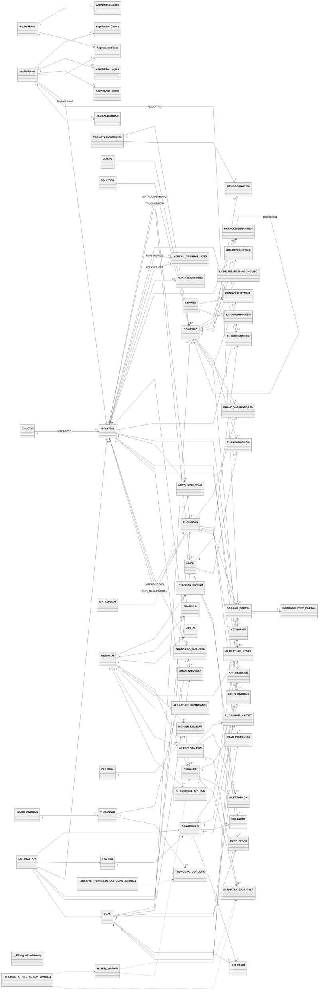

# Lien ket bang theo nhom (chi ten bang + quan he)

```mermaid
%%{init: { "theme": "neutral", "flowchart": { "curve": "linear" } }}%%
classDiagram
direction LR

%% ========== 1) Identity & Tai khoan ==========
class AspNetUsers
class AspNetRoles
class AspNetUserRoles
class AspNetUserClaims
class AspNetRoleClaims
class AspNetUserLogins
class AspNetUserTokens

AspNetUsers "1" --> "0..*" AspNetUserClaims
AspNetUsers "1" --> "0..*" AspNetUserLogins
AspNetUsers "1" --> "0..*" AspNetUserTokens
AspNetUsers "1" --> "0..*" AspNetUserRoles
AspNetRoles "1" --> "0..*" AspNetRoleClaims
AspNetRoles "1" --> "0..*" AspNetUserRoles

%% ========== 2) To chuc nhan su ==========
class NHANVIEN
class CHUCVU
class PHONGBAN
class NHOM
class THANHVIENNHOM
class YEUCAU_CAPNHAT_HOSO
class NHATKYHOATDONG

CHUCVU "1" --> "0..*" NHANVIEN : MACHUCVU
PHONGBAN "1" --> "0..*" NHANVIEN : MAPHONGBAN
PHONGBAN "1" --> "0..*" NHANVIEN : PHO_MAPHONGBAN
NHANVIEN "1" --> "0..*" PHONGBAN : MATRUONGPHONG
NHANVIEN "1" --> "0..*" NHOM : TRUONGNHOM
NHANVIEN "1" --> "0..*" THANHVIENNHOM
NHOM "1" --> "0..*" THANHVIENNHOM
NHANVIEN "1" --> "0..*" YEUCAU_CAPNHAT_HOSO : MANHANVIEN
NHANVIEN "1" --> "0..*" YEUCAU_CAPNHAT_HOSO : NGUOIDUYET
NHANVIEN "1" --> "0..*" NHATKYHOATDONG

%% Xuong song Identity <-> Nhan su
AspNetUsers "1" --> "0..1" NHANVIEN : AspNetUserId

%% ========== 3) Du an & Cong viec ==========
class DUAN
class CONGVIEC
class TRANGTHAICONGVIEC
class DOKHO
class DOUUTIEN
class NHATKYCONGVIEC
class LICHSUTRANGTHAICONGVIEC
class TIENDOCONGVIEC
class PHANCONGNHANVIEN
class PHANCONGNHOM
class PHANCONGPHONGBAN
class DUAN_NHANVIEN
class DUAN_NHOM
class DUAN_PHONGBAN
class CONGVIEC_KYNANG
class KYNANGNHANVIEN
class KYNANG

DUAN "1" --> "0..*" CONGVIEC
TRANGTHAICONGVIEC "1" --> "0..*" CONGVIEC
DOKHO "1" --> "0..*" CONGVIEC
DOUUTIEN "1" --> "0..*" CONGVIEC
CONGVIEC "1" --> "0..*" CONGVIEC : parent-child
CONGVIEC "1" --> "0..*" NHATKYCONGVIEC
CONGVIEC "1" --> "0..*" LICHSUTRANGTHAICONGVIEC
CONGVIEC "1" --> "0..*" TIENDOCONGVIEC
TRANGTHAICONGVIEC "1" --> "0..*" TIENDOCONGVIEC
CONGVIEC "1" --> "0..*" PHANCONGNHANVIEN
NHANVIEN "1" --> "0..*" PHANCONGNHANVIEN
CONGVIEC "1" --> "0..*" PHANCONGNHOM
NHOM "1" --> "0..*" PHANCONGNHOM
CONGVIEC "1" --> "0..*" PHANCONGPHONGBAN
PHONGBAN "1" --> "0..*" PHANCONGPHONGBAN
DUAN "1" --> "0..*" DUAN_NHANVIEN
NHANVIEN "1" --> "0..*" DUAN_NHANVIEN
DUAN "1" --> "0..*" DUAN_NHOM
NHOM "1" --> "0..*" DUAN_NHOM
DUAN "1" --> "0..*" DUAN_PHONGBAN
PHONGBAN "1" --> "0..*" DUAN_PHONGBAN
CONGVIEC "1" --> "0..*" CONGVIEC_KYNANG
KYNANG "1" --> "0..*" CONGVIEC_KYNANG
NHANVIEN "1" --> "0..*" KYNANGNHANVIEN
KYNANG "1" --> "0..*" KYNANGNHANVIEN

%% ========== 4) KPI ==========
class LOAIKPI
class DANHMUCKPI
class KPI_XEPLOAI
class KETQUAKPI
class KETQUAKPI_TONG
class KPI_NHANVIEN
class KPI_NHOM
class KPI_PHONGBAN
class KPI_DUAN
class DE_XUAT_KPI

LOAIKPI "1" --> "0..*" DANHMUCKPI
DANHMUCKPI "1" --> "0..*" KETQUAKPI
NHANVIEN "1" --> "0..*" KETQUAKPI
NHANVIEN "1" --> "0..*" KETQUAKPI_TONG
DANHMUCKPI "1" --> "0..*" KPI_NHANVIEN
NHANVIEN "1" --> "0..*" KPI_NHANVIEN
DANHMUCKPI "1" --> "0..*" KPI_NHOM
NHOM "1" --> "0..*" KPI_NHOM
DANHMUCKPI "1" --> "0..*" KPI_PHONGBAN
PHONGBAN "1" --> "0..*" KPI_PHONGBAN
DANHMUCKPI "1" --> "0..*" KPI_DUAN
DUAN "1" --> "0..*" KPI_DUAN
KPI_XEPLOAI ..> KETQUAKPI_TONG
DE_XUAT_KPI --> DANHMUCKPI
DE_XUAT_KPI --> LOAIKPI
DE_XUAT_KPI --> NHANVIEN
DE_XUAT_KPI --> NHOM
DE_XUAT_KPI --> PHONGBAN
DE_XUAT_KPI --> DUAN

%% ========== 5) AI/ML ==========
class MOHINHAI
class PHIENBAN_MOHINH
class THAMSOAI
class LOG_AI
class DULIEUAI
class DUDOANAI
class MOHINH_DULIEUAI
class AI_DANHGIA_RUN
class AI_DANHGIA_CHITIET
class AI_FEEDBACK
class AI_NHATKY_CAN_THIEP
class AI_BUSINESS_KPI_RUN
class AI_FEATURE_STORE
class AI_FEATURE_IMPORTANCE
class AI_HITL_ACTION

MOHINHAI "1" --> "0..*" PHIENBAN_MOHINH
MOHINHAI "1" --> "0..*" THAMSOAI
MOHINHAI "1" --> "0..*" LOG_AI
MOHINHAI "1" --> "0..*" DUDOANAI
NHANVIEN "1" --> "0..*" DUDOANAI
DULIEUAI "1" --> "0..*" MOHINH_DULIEUAI
MOHINHAI "1" --> "0..*" MOHINH_DULIEUAI
MOHINHAI "1" --> "0..*" AI_FEATURE_STORE
NHANVIEN "1" --> "0..*" AI_FEATURE_STORE
CONGVIEC "1" --> "0..*" AI_FEATURE_STORE
DUAN "1" --> "0..*" AI_FEATURE_STORE
MOHINHAI "1" --> "0..*" AI_FEATURE_IMPORTANCE
MOHINHAI "1" --> "0..*" AI_DANHGIA_RUN
AI_DANHGIA_RUN "1" --> "0..*" AI_DANHGIA_CHITIET
DUDOANAI "1" --> "0..*" AI_DANHGIA_CHITIET
AI_DANHGIA_RUN "1" --> "0..*" AI_FEEDBACK
DUDOANAI "1" --> "0..*" AI_FEEDBACK
AI_DANHGIA_RUN "1" --> "0..*" AI_NHATKY_CAN_THIEP
DUDOANAI "1" --> "0..*" AI_NHATKY_CAN_THIEP
MOHINHAI "1" --> "0..*" AI_BUSINESS_KPI_RUN
AI_HITL_ACTION ..> AI_NHATKY_CAN_THIEP
AI_HITL_ACTION ..> DUDOANAI

%% ========== 6) Thong bao & Bao cao ==========
class LOAITHONGBAO
class THONGBAO
class THONGBAO_NHANVIEN
class THONGBAO_DOITUONG
class BAOCAO_PORTAL
class BAOCAOCHITIET_PORTAL
class YEUCAUBAOCAO

LOAITHONGBAO "1" --> "0..*" THONGBAO
THONGBAO "1" --> "0..*" THONGBAO_NHANVIEN
NHANVIEN "1" --> "0..*" THONGBAO_NHANVIEN
THONGBAO "1" --> "0..*" THONGBAO_DOITUONG
BAOCAO_PORTAL "1" --> "0..*" BAOCAOCHITIET_PORTAL
DUAN "1" --> "0..*" BAOCAO_PORTAL
PHONGBAN "1" --> "0..*" BAOCAO_PORTAL
AspNetUsers "1" --> "0..*" BAOCAO_PORTAL : NGUOITAO
AspNetUsers "1" --> "0..*" YEUCAUBAOCAO

%% ========== 7) He thong / lich su ==========
class __EFMigrationsHistory
class _ARCHIVE_AI_HITL_ACTION_20260521
class _ARCHIVE_THONGBAO_DOITUONG_20260521

_ARCHIVE_AI_HITL_ACTION_20260521 ..> AI_HITL_ACTION
_ARCHIVE_AI_HITL_ACTION_20260521 ..> AI_NHATKY_CAN_THIEP
_ARCHIVE_THONGBAO_DOITUONG_20260521 ..> THONGBAO_DOITUONG
```
