# Sequence Diagram

## 1. Đăng nhập hệ thống
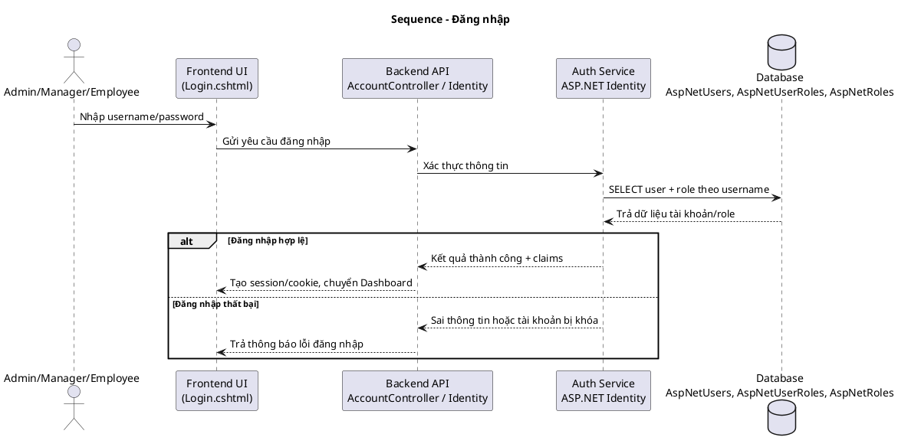

## 2. Quản lý nhân viên (Admin)
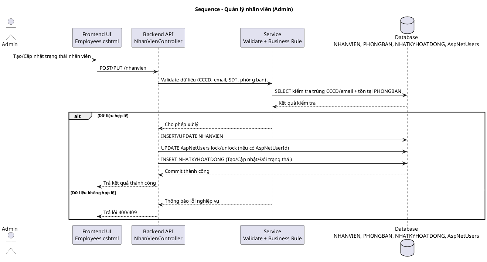

## 3. Quản lý phòng ban (Admin)
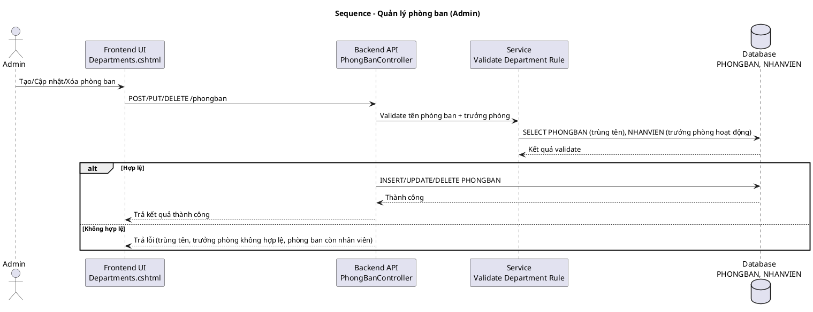

## 4. Quản lý tài khoản và phân quyền (Admin)
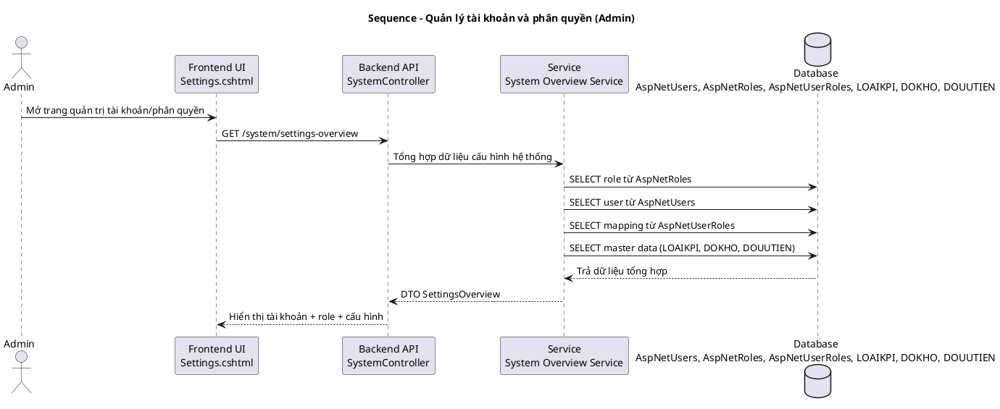

## 5. Quản lý công việc - Tạo công việc (Manager)
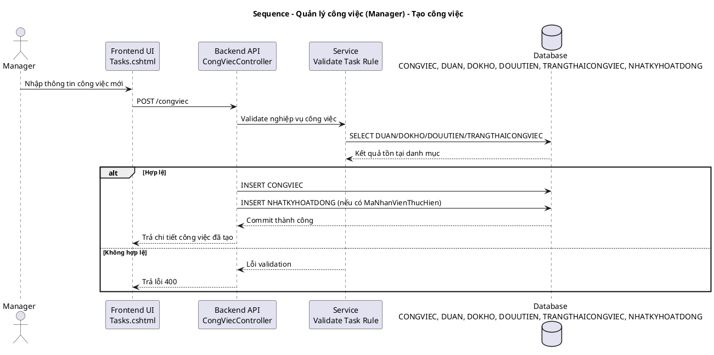

## 6. Quản lý công việc - Phân công công việc (Manager)
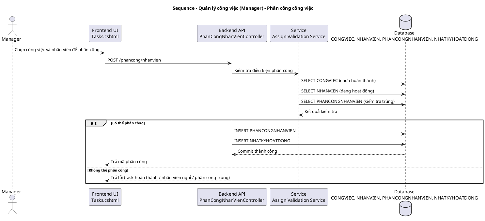

## 7. Theo dõi tiến độ công việc (Manager + Employee)
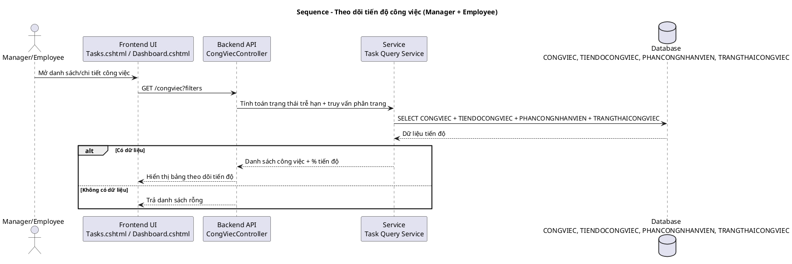

## 8. Cập nhật tiến độ công việc (Employee)
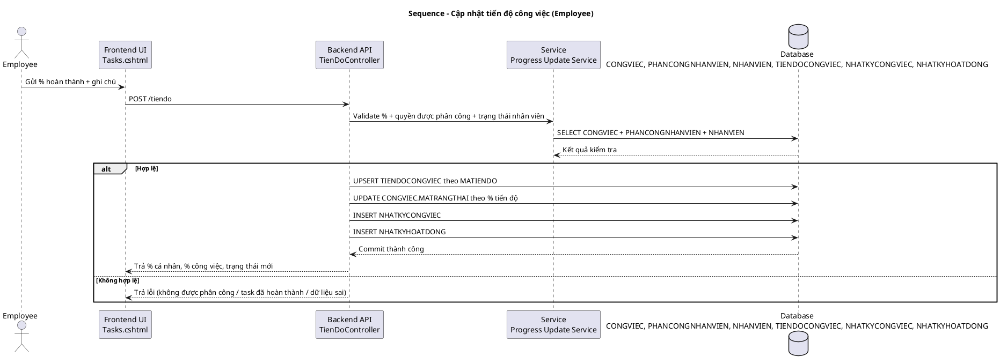

## 9. Đánh giá hiệu suất nhân viên (Manager)
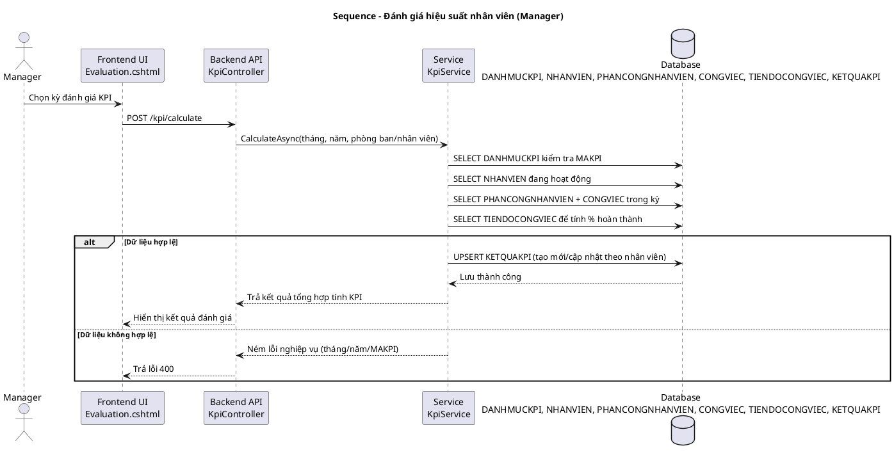

## 10. Xem KPI và kết quả đánh giá (Employee)
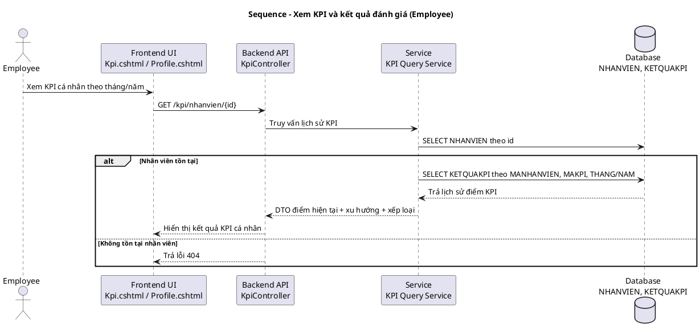

## 11. Xem báo cáo hiệu suất (Manager)
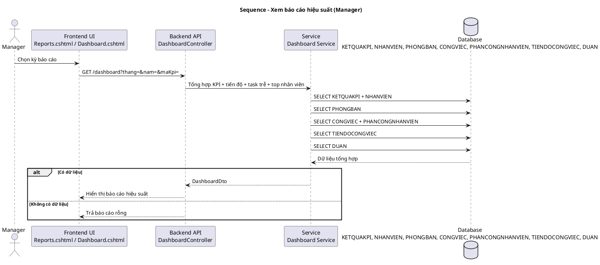

## 12. Ghi log hoạt động hệ thống (Audit Log)
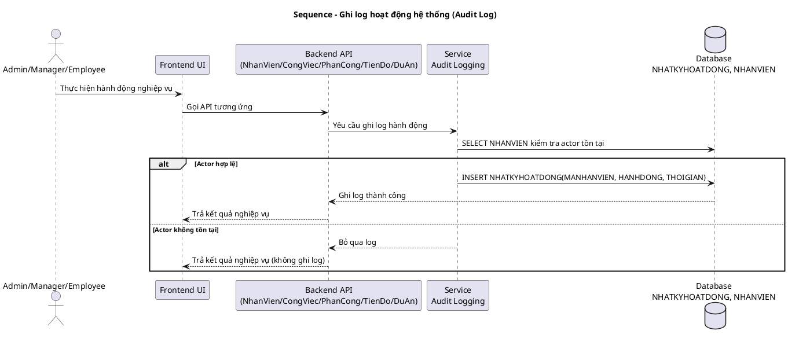

## 13. Tích hợp hệ thống đánh giá KPI (xử lý dữ liệu KPI)
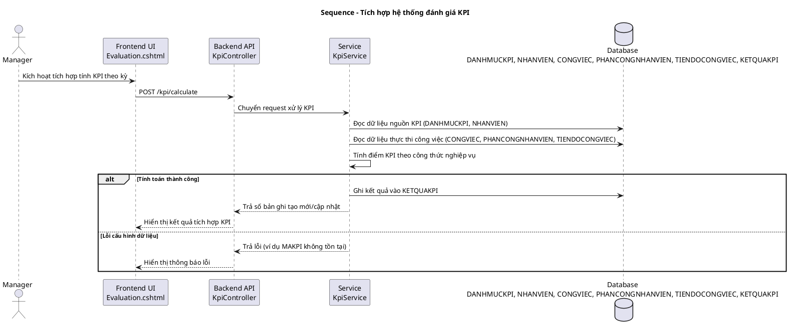
