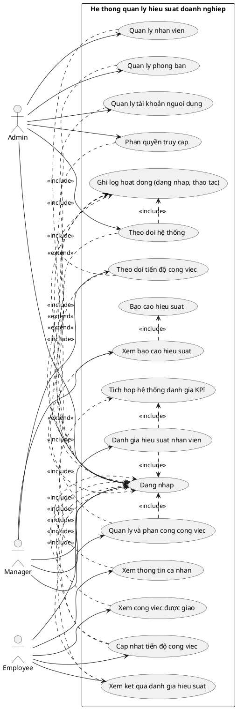

```plantuml
@startuml
left to right direction
skinparam packageStyle rectangle

actor Admin
actor Manager
actor Employee

rectangle "He thong quan ly hieu suat doanh nghiep" {
  usecase "Dang nhap" as UC_Login

  usecase "Quan ly nhan vien" as UC_Admin_Employees
  usecase "Quan ly phong ban" as UC_Admin_Departments
  usecase "Quan ly tài khoản nguoi dung" as UC_Admin_Accounts
  usecase "Phan quyền truy cap" as UC_Admin_Authorization
  usecase "Theo doi hệ thống" as UC_Admin_SystemMonitoring

  usecase "Quan ly và phan cong cong viec" as UC_Manager_TaskAssign
  usecase "Theo doi tiến độ cong viec" as UC_Manager_TrackProgress
  usecase "Xem bao cao hieu suat" as UC_Manager_PerformanceReports
  usecase "Danh gia hieu suat nhan vien" as UC_Manager_EvaluateEmployee

  usecase "Xem thong tin ca nhan" as UC_Employee_Profile
  usecase "Xem cong viec được giao" as UC_Employee_ViewTasks
  usecase "Cap nhat tiến độ cong viec" as UC_Employee_UpdateProgress
  usecase "Xem ket qua danh gia hieu suat" as UC_Employee_ViewEvaluation

  usecase "Tich hop hệ thống danh gia KPI" as UC_KPI
  usecase "Ghi log hoat dong (dang nhap, thao tac)" as UC_ActivityLog
  usecase "Bao cao hieu suat" as UC_PerformanceReporting
}

Admin --> UC_Login
Admin --> UC_Admin_Employees
Admin --> UC_Admin_Departments
Admin --> UC_Admin_Accounts
Admin --> UC_Admin_Authorization
Admin --> UC_Admin_SystemMonitoring

Manager --> UC_Login
Manager --> UC_Manager_TaskAssign
Manager --> UC_Manager_TrackProgress
Manager --> UC_Manager_PerformanceReports
Manager --> UC_Manager_EvaluateEmployee

Employee --> UC_Login
Employee --> UC_Employee_Profile
Employee --> UC_Employee_ViewTasks
Employee --> UC_Employee_UpdateProgress
Employee --> UC_Employee_ViewEvaluation

UC_Admin_Employees .> UC_Login : <<include>>
UC_Admin_Departments .> UC_Login : <<include>>
UC_Admin_Accounts .> UC_Login : <<include>>
UC_Admin_Authorization .> UC_Login : <<include>>
UC_Admin_SystemMonitoring .> UC_Login : <<include>>

UC_Manager_TaskAssign .> UC_Login : <<include>>
UC_Manager_TrackProgress .> UC_Login : <<include>>
UC_Manager_PerformanceReports .> UC_Login : <<include>>
UC_Manager_EvaluateEmployee .> UC_Login : <<include>>

UC_Employee_Profile .> UC_Login : <<include>>
UC_Employee_ViewTasks .> UC_Login : <<include>>
UC_Employee_UpdateProgress .> UC_Login : <<include>>
UC_Employee_ViewEvaluation .> UC_Login : <<include>>

UC_Manager_EvaluateEmployee .> UC_KPI : <<include>>
UC_Employee_ViewEvaluation .> UC_KPI : <<include>>
UC_Manager_PerformanceReports .> UC_PerformanceReporting : <<include>>
UC_Admin_SystemMonitoring .> UC_ActivityLog : <<include>>
UC_Login .> UC_ActivityLog : <<extend>>
UC_Manager_TaskAssign .> UC_ActivityLog : <<extend>>
UC_Manager_TrackProgress .> UC_ActivityLog : <<extend>>
UC_Employee_UpdateProgress .> UC_ActivityLog : <<extend>>

@enduml
```
