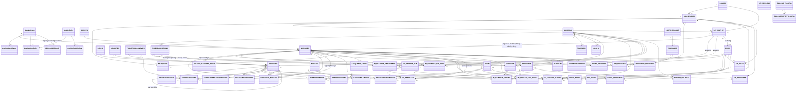

# LV2026 - Class Diagram Tong Hop (1 So Do)

```mermaid
classDiagram
class AspNetUsers
class AspNetRoles
class AspNetUserRoles
class AspNetUserClaims
class AspNetRoleClaims

class NHANVIEN
class CHUCVU
class PHONGBAN
class NHOM
class THANHVIENNHOM
class YEUCAU_CAPNHAT_HOSO

class DUAN
class CONGVIEC
class DOKHO
class DOUUTIEN
class TRANGTHAICONGVIEC
class PHANCONGNHANVIEN
class PHANCONGNHOM
class PHANCONGPHONGBAN
class TIENDOCONGVIEC
class NHATKYCONGVIEC
class LICHSUTRANGTHAICONGVIEC
class DUAN_NHANVIEN
class DUAN_NHOM
class DUAN_PHONGBAN
class CONGVIEC_KYNANG
class KYNANG
class KYNANGNHANVIEN

class LOAIKPI
class DANHMUCKPI
class DE_XUAT_KPI
class KETQUAKPI
class KETQUAKPI_TONG
class KPI_NHANVIEN
class KPI_NHOM
class KPI_PHONGBAN
class KPI_DUAN
class KPI_XEPLOAI

class MOHINHAI
class PHIENBAN_MOHINH
class THAMSOAI
class DULIEUAI
class MOHINH_DULIEUAI
class DUDOANAI
class AI_FEATURE_STORE
class AI_FEATURE_IMPORTANCE
class AI_DANHGIA_RUN
class AI_DANHGIA_CHITIET
class AI_FEEDBACK
class AI_NHATKY_CAN_THIEP
class AI_BUSINESS_KPI_RUN
class LOG_AI

class LOAITHONGBAO
class THONGBAO
class THONGBAO_NHANVIEN
class BAOCAO_PORTAL
class BAOCAOCHITIET_PORTAL
class YEUCAUBAOCAO
class NHATKYHOATDONG

AspNetUsers "1" --> "0..1" NHANVIEN
AspNetUsers "1" --> "0..*" AspNetUserClaims
AspNetUsers "1" --> "0..*" AspNetUserRoles
AspNetRoles "1" --> "0..*" AspNetUserRoles
AspNetRoles "1" --> "0..*" AspNetRoleClaims

CHUCVU "1" --> "0..*" NHANVIEN
PHONGBAN "1" --> "0..*" NHANVIEN
NHANVIEN "1" --> "0..*" PHONGBAN : truong/pho phong
NHANVIEN "1" --> "0..*" NHOM : truong nhom
NHOM "1" --> "0..*" THANHVIENNHOM
NHANVIEN "1" --> "0..*" THANHVIENNHOM
NHANVIEN "1" --> "0..*" YEUCAU_CAPNHAT_HOSO : nguoi tao/duyet

DUAN "1" --> "0..*" CONGVIEC
CONGVIEC "1" --> "0..*" CONGVIEC : parent-child
DOKHO "1" --> "0..*" CONGVIEC
DOUUTIEN "1" --> "0..*" CONGVIEC
TRANGTHAICONGVIEC "1" --> "0..*" CONGVIEC

CONGVIEC "1" --> "0..*" PHANCONGNHANVIEN
NHANVIEN "1" --> "0..*" PHANCONGNHANVIEN
CONGVIEC "1" --> "0..*" PHANCONGNHOM
NHOM "1" --> "0..*" PHANCONGNHOM
CONGVIEC "1" --> "0..*" PHANCONGPHONGBAN
PHONGBAN "1" --> "0..*" PHANCONGPHONGBAN

CONGVIEC "1" --> "0..*" TIENDOCONGVIEC
NHANVIEN "1" --> "0..*" TIENDOCONGVIEC : nguoi phe duyet
TRANGTHAICONGVIEC "1" --> "0..*" TIENDOCONGVIEC
CONGVIEC "1" --> "0..*" NHATKYCONGVIEC
CONGVIEC "1" --> "0..*" LICHSUTRANGTHAICONGVIEC

DUAN "1" --> "0..*" DUAN_NHANVIEN
NHANVIEN "1" --> "0..*" DUAN_NHANVIEN
DUAN "1" --> "0..*" DUAN_NHOM
NHOM "1" --> "0..*" DUAN_NHOM
DUAN "1" --> "0..*" DUAN_PHONGBAN
PHONGBAN "1" --> "0..*" DUAN_PHONGBAN

CONGVIEC "1" --> "0..*" CONGVIEC_KYNANG
KYNANG "1" --> "0..*" CONGVIEC_KYNANG
NHANVIEN "1" --> "0..*" KYNANGNHANVIEN
KYNANG "1" --> "0..*" KYNANGNHANVIEN

LOAIKPI "1" --> "0..*" DANHMUCKPI
DANHMUCKPI "1" --> "0..*" DE_XUAT_KPI
LOAIKPI "1" --> "0..*" DE_XUAT_KPI
DANHMUCKPI "1" --> "0..*" KETQUAKPI
NHANVIEN "1" --> "0..*" KETQUAKPI
NHANVIEN "1" --> "0..*" KETQUAKPI_TONG

DANHMUCKPI "1" --> "0..*" KPI_NHANVIEN
NHANVIEN "1" --> "0..*" KPI_NHANVIEN
DANHMUCKPI "1" --> "0..*" KPI_NHOM
NHOM "1" --> "0..*" KPI_NHOM
DANHMUCKPI "1" --> "0..*" KPI_PHONGBAN
PHONGBAN "1" --> "0..*" KPI_PHONGBAN
DANHMUCKPI "1" --> "0..*" KPI_DUAN
DUAN "1" --> "0..*" KPI_DUAN

DE_XUAT_KPI "0..*" --> "0..1" NHANVIEN : nguoi de xuat/duyet/cap nhat/ap dung
DE_XUAT_KPI "0..*" --> "0..1" NHOM : ap dung
DE_XUAT_KPI "0..*" --> "0..1" PHONGBAN : ap dung
DE_XUAT_KPI "0..*" --> "0..1" DUAN : ap dung

MOHINHAI "1" --> "0..*" PHIENBAN_MOHINH
MOHINHAI "1" --> "0..*" THAMSOAI
MOHINHAI "1" --> "0..*" LOG_AI
MOHINHAI "1" --> "0..*" DUDOANAI
NHANVIEN "1" --> "0..*" DUDOANAI

MOHINHAI "1" --> "0..*" AI_FEATURE_STORE
NHANVIEN "1" --> "0..*" AI_FEATURE_STORE
CONGVIEC "1" --> "0..*" AI_FEATURE_STORE
DUAN "1" --> "0..*" AI_FEATURE_STORE

MOHINHAI "1" --> "0..*" AI_FEATURE_IMPORTANCE
PHIENBAN_MOHINH "1" --> "0..*" AI_FEATURE_IMPORTANCE
MOHINHAI "1" --> "0..*" AI_DANHGIA_RUN
PHIENBAN_MOHINH "1" --> "0..*" AI_DANHGIA_RUN
AI_DANHGIA_RUN "1" --> "0..*" AI_DANHGIA_CHITIET
DUDOANAI "1" --> "0..*" AI_DANHGIA_CHITIET
NHANVIEN "1" --> "0..*" AI_DANHGIA_CHITIET
CONGVIEC "1" --> "0..*" AI_DANHGIA_CHITIET
DUAN "1" --> "0..*" AI_DANHGIA_CHITIET

AI_DANHGIA_RUN "1" --> "0..*" AI_FEEDBACK
DUDOANAI "1" --> "0..*" AI_FEEDBACK
NHANVIEN "1" --> "0..*" AI_FEEDBACK : nguoi gui/xu ly
DUDOANAI "1" --> "0..*" AI_NHATKY_CAN_THIEP
AI_DANHGIA_RUN "1" --> "0..*" AI_NHATKY_CAN_THIEP
NHANVIEN "1" --> "0..*" AI_NHATKY_CAN_THIEP
MOHINHAI "1" --> "0..*" AI_BUSINESS_KPI_RUN
PHIENBAN_MOHINH "1" --> "0..*" AI_BUSINESS_KPI_RUN
DULIEUAI "1" --> "0..*" MOHINH_DULIEUAI
MOHINHAI "1" --> "0..*" MOHINH_DULIEUAI
NHANVIEN "1" --> "0..*" DULIEUAI

LOAITHONGBAO "1" --> "0..*" THONGBAO
THONGBAO "1" --> "0..*" THONGBAO_NHANVIEN
NHANVIEN "1" --> "0..*" THONGBAO_NHANVIEN
BAOCAO_PORTAL "1" --> "0..*" BAOCAOCHITIET_PORTAL
AspNetUsers "1" --> "0..*" YEUCAUBAOCAO : nguoi yeu cau/nguoi nhan
NHANVIEN "1" --> "0..*" NHATKYHOATDONG
```

