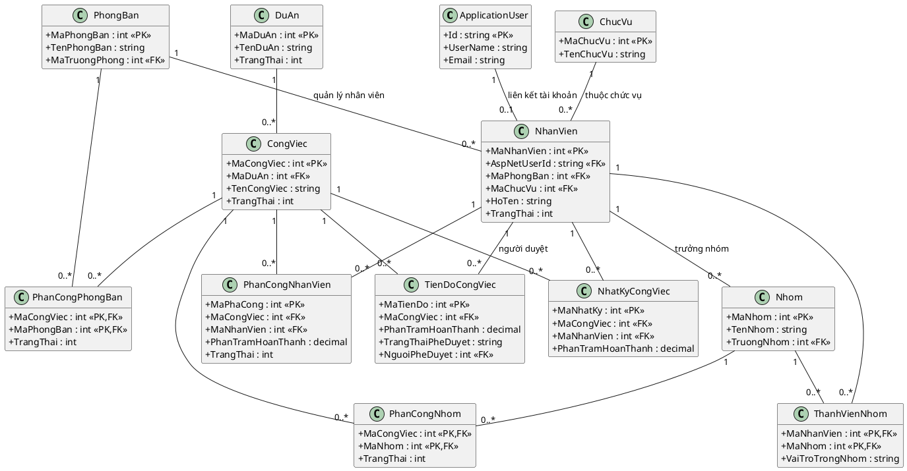
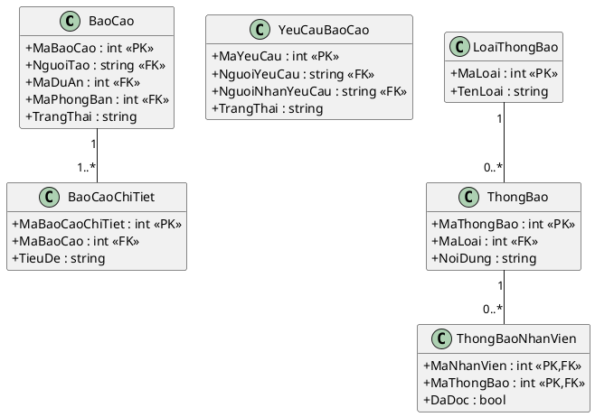

# Class Diagram (ER rút gọn)

## Mục đích
Biểu diễn cấu trúc dữ liệu cốt lõi của hệ thống theo mức ER rút gọn, tập trung vào thực thể nghiệp vụ chính, khóa và quan hệ.

## A) Core Business

## B) KPI + AI

```plantuml
@startuml
hide methods
skinparam classAttributeIconSize 0

class LoaiKpi {
  +MaLoaiKpi : int <<PK>>
  +TenLoaiKpi : string
  +HeSo : decimal
}

class DanhMucKpi {
  +MaKpi : int <<PK>>
  +MaLoaiKpi : int <<FK>>
  +TenKpi : string
  +TrongSoGoc : decimal
}

class KpiNhanVien {
  +MaKpi : int <<PK,FK>>
  +MaNhanVien : int <<PK,FK>>
}

class KpiNhom {
  +MaKpi : int <<PK,FK>>
  +MaNhom : int <<PK,FK>>
}

class KpiPhongBan {
  +MaKpi : int <<PK,FK>>
  +MaPhongBan : int <<PK,FK>>
}

class KpiDuAn {
  +MaKpi : int <<PK,FK>>
  +MaDuAn : int <<PK,FK>>
}

class KetQuaKpi {
  +MaKetQua : int <<PK>>
  +MaNhanVien : int <<FK>>
  +MaKpi : int <<FK>>
  +Thang : int
  +Nam : int
  +DiemKpi : decimal
}

class KetQuaKpiTong {
  +MaTong : int <<PK>>
  +MaNhanVien : int <<FK>>
  +Thang : int
  +Nam : int
  +DiemTong : decimal
}

class DeXuatKpi {
  +MaDeXuat : int <<PK>>
  +MaKpi : int <<FK>>
  +NguoiDeXuat : int <<FK>>
  +TrangThai : string
}

class KpiXepLoai {
  +MaXepLoai : int <<PK>>
  +TenXepLoai : string
  +DiemTu : decimal
  +DiemDen : decimal
}

class MoHinhAi {
  +MaModel : int <<PK>>
  +TenModel : string
  +Version : string
}

class DuDoanAi {
  +MaDuDoan : int <<PK>>
  +MaModel : int <<FK>>
  +MaNhanVien : int <<FK>>
  +MaCongViec : int <<FK>>
  +XacSuatTreHan : decimal
}

class AiFeatureStore {
  +MaFeature : int <<PK>>
  +MaModel : int <<FK>>
  +MaNhanVien : int <<FK>>
  +FeatureName : string
}

class AiDanhGiaRun {
  +MaDanhGia : int <<PK>>
  +MaModel : int <<FK>>
  +NgayDanhGia : datetime
  +Accuracy : decimal
}

class AiDanhGiaChiTiet {
  +MaDanhGiaChiTiet : int <<PK>>
  +MaDanhGia : int <<FK>>
  +MaDuDoan : int <<FK>>
  +DungNhan : bool
}

class AiFeedback {
  +MaFeedback : int <<PK>>
  +MaDanhGia : int <<FK>>
  +MaDuDoan : int <<FK>>
  +MaNhanVien : int <<FK>>
  +MucHuuIch : int
}

class AiNhatKyCanThiep {
  +MaCanThiep : int <<PK>>
  +MaDanhGia : int <<FK>>
  +MaDuDoan : int <<FK>>
  +NguoiCanThiep : int <<FK>>
  +ActionType : string
}

class AiBusinessKpiRun {
  +MaBusinessKpi : int <<PK>>
  +MaModel : int <<FK>>
  +NgayTao : datetime
  +UtilityScore : decimal
}

LoaiKpi "1" -- "0..*" DanhMucKpi
DanhMucKpi "1" -- "0..*" KpiNhanVien
DanhMucKpi "1" -- "0..*" KpiNhom
DanhMucKpi "1" -- "0..*" KpiPhongBan
DanhMucKpi "1" -- "0..*" KpiDuAn
DanhMucKpi "1" -- "0..*" KetQuaKpi
DanhMucKpi "1" -- "0..*" DeXuatKpi

MoHinhAi "1" -- "0..*" DuDoanAi
MoHinhAi "1" -- "0..*" AiFeatureStore
MoHinhAi "1" -- "0..*" AiDanhGiaRun
MoHinhAi "1" -- "0..*" AiBusinessKpiRun
AiDanhGiaRun "1" -- "0..*" AiDanhGiaChiTiet
DuDoanAi "1" -- "0..*" AiDanhGiaChiTiet
AiDanhGiaRun "1" -- "0..*" AiFeedback
DuDoanAi "1" -- "0..*" AiFeedback
DuDoanAi "1" -- "0..*" AiNhatKyCanThiep
AiDanhGiaRun "1" -- "0..*" AiNhatKyCanThiep
@enduml
```

## C) Report + Notification

## Mô tả ngắn
- **Thành phần tham gia:** các thực thể domain cốt lõi thuộc Core Business, KPI+AI, Report+Notification.
- **Dữ liệu chính:** khóa định danh nghiệp vụ, liên kết phân quyền/ngữ cảnh tổ chức, quan hệ phân công và đánh giá.
- **Kết quả đầu ra:** cấu trúc dữ liệu đủ dùng cho phân tích thiết kế ở mức luận văn, phản ánh quan hệ 1-n và n-n qua bảng trung gian.

