# Sequence Diagram Full (Theo luồng nghiệp vụ)

## Mục đích
Mô tả động học xử lý nghiệp vụ của hệ thống WebApp + AI, tập trung các luồng nghiệp vụ cốt lõi thay vì chi tiết hóa từng endpoint nhỏ.

## 1) Đăng nhập + phân quyền truy cập
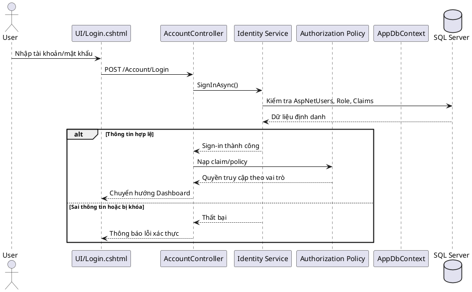

## 2) Tạo công việc + phân công nhân viên/nhóm/phòng ban
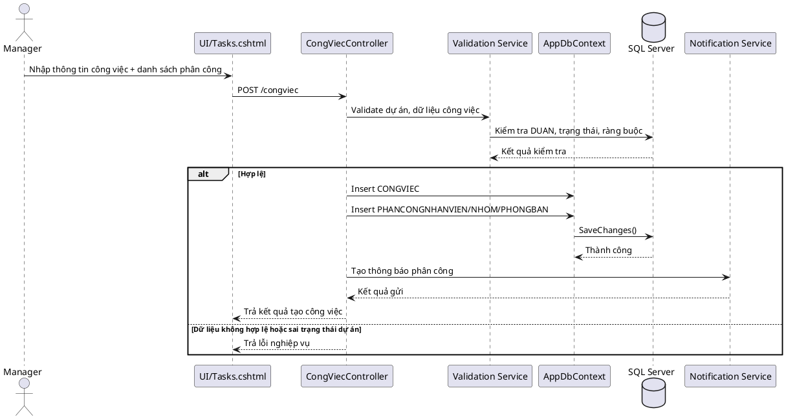

## 3) Nhân viên cập nhật tiến độ + quản lý duyệt/từ chối
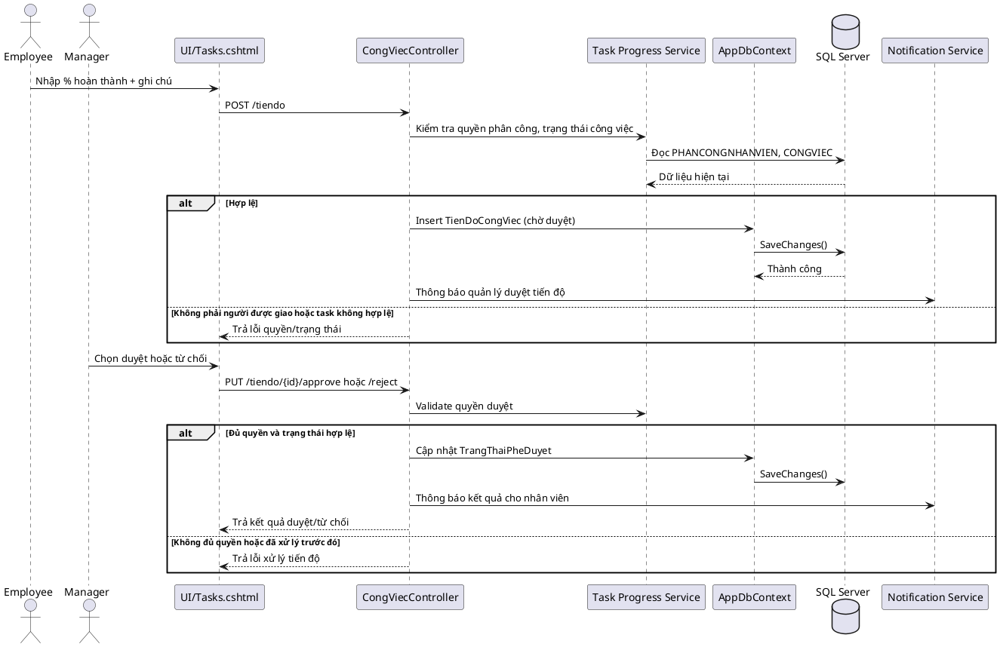

## 4) Tính KPI nhân viên/đội theo kỳ đánh giá
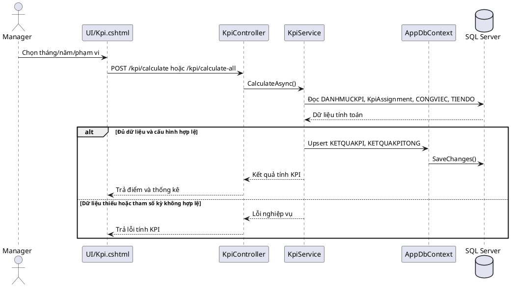

## 5) Đề xuất KPI + duyệt/từ chối đề xuất
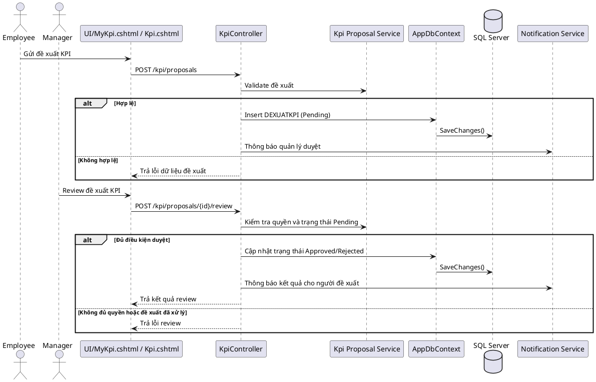

## 6) AI dự báo rủi ro trễ hạn công việc
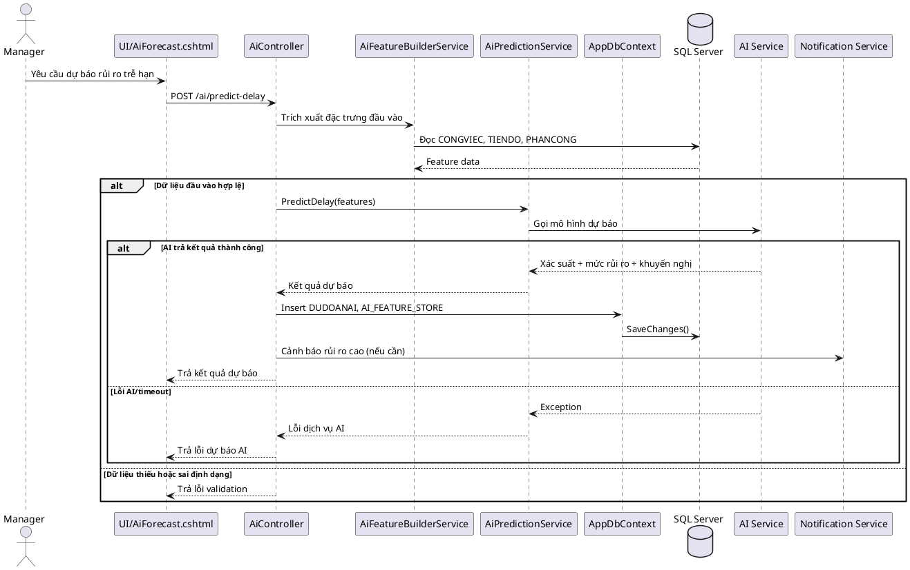

## 7) AI feedback + intervention log/HITL
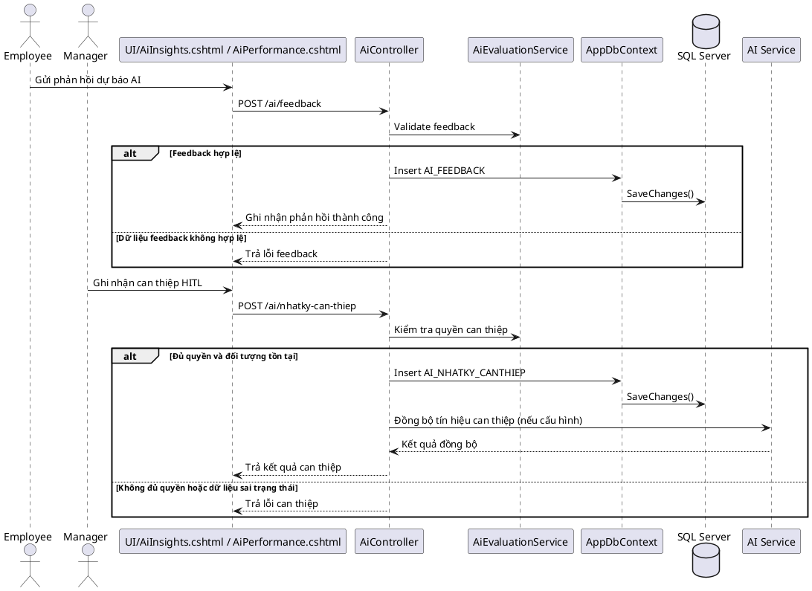

## 8) Tạo báo cáo + export PDF/Excel
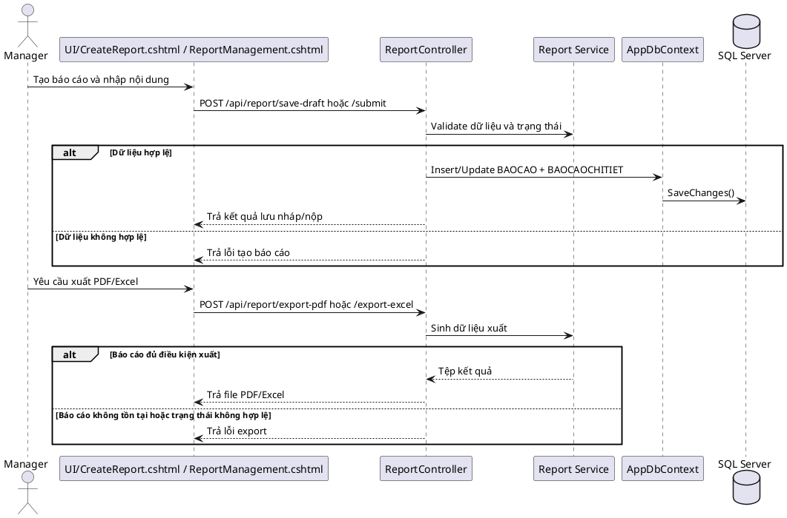

## 9) Quản lý nhân viên + yêu cầu cập nhật hồ sơ
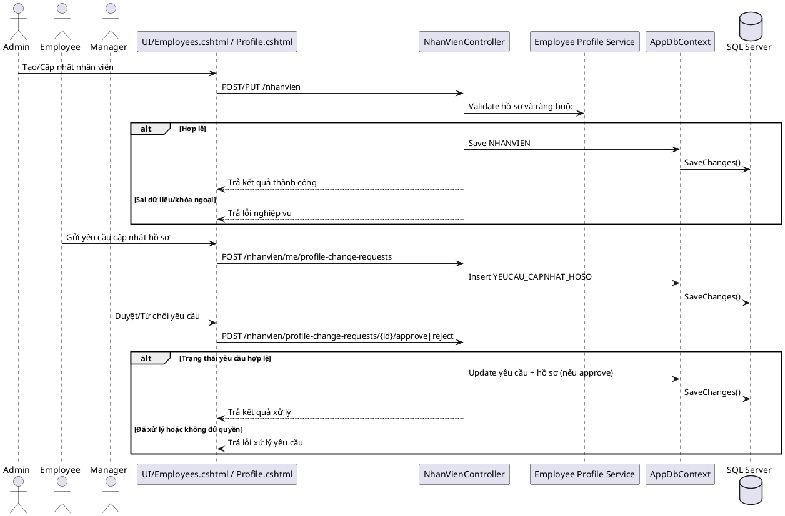

## 10) Quản lý phòng ban/nhóm và thành viên
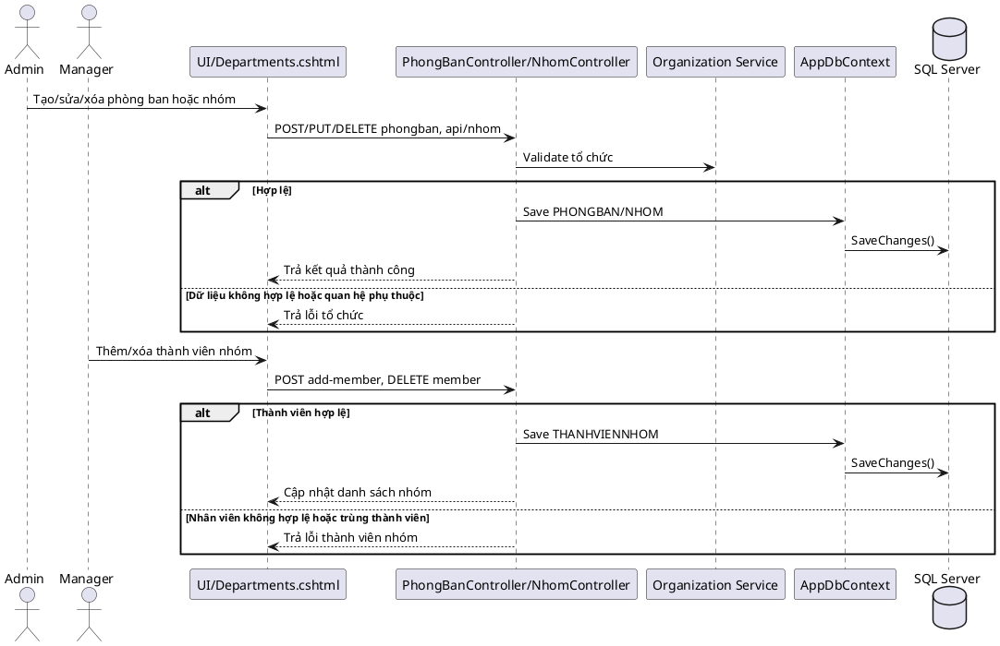

## 11) Dashboard tổng hợp chỉ số
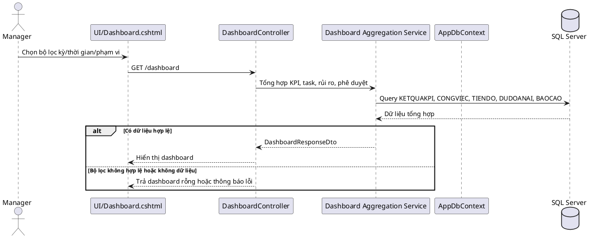

## 12) Thông báo + đánh dấu đã đọc
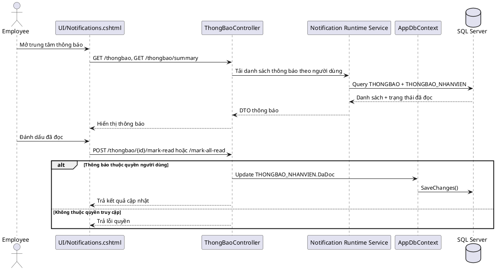

## Mô tả ngắn
- **Thành phần tham gia:** Actor nghiệp vụ, UI/View, Controller/API, Service, AppDbContext, Database và dịch vụ ngoài (AI, Notification, Identity).
- **Dữ liệu chính:** tài khoản/role/claim, dữ liệu công việc-tiến độ, KPI, báo cáo, bản ghi dự báo và phản hồi AI, thông báo.
- **Kết quả đầu ra:** mỗi quy trình phản ánh đầy đủ luồng chính và nhánh ngoại lệ phục vụ phân tích thiết kế hệ thống.

