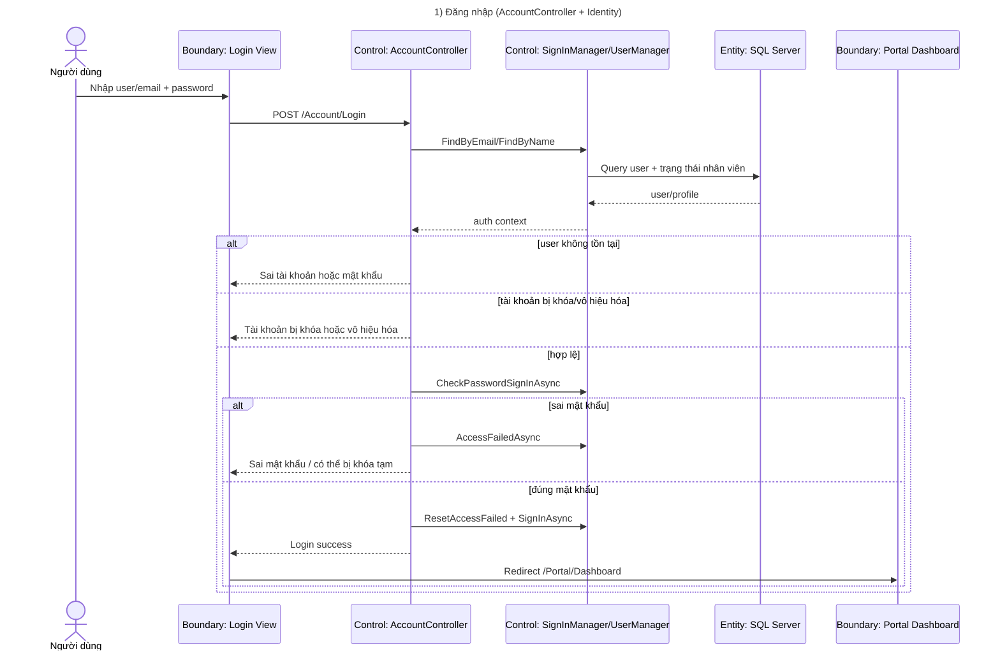
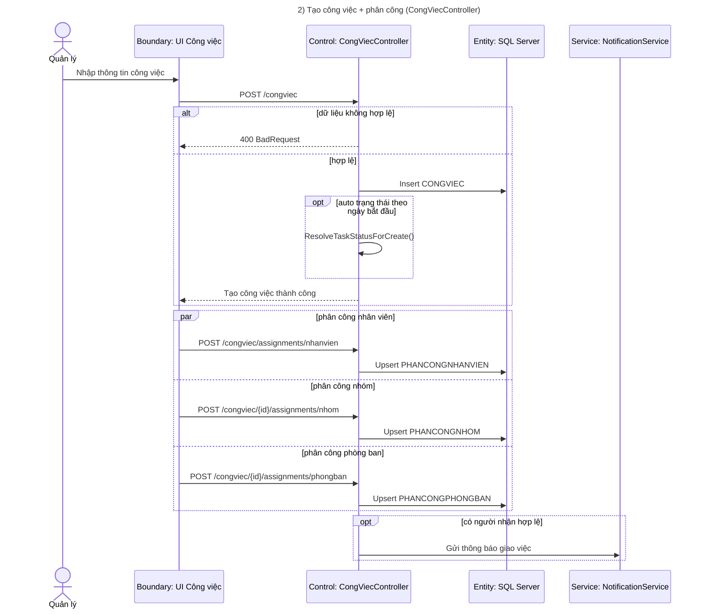
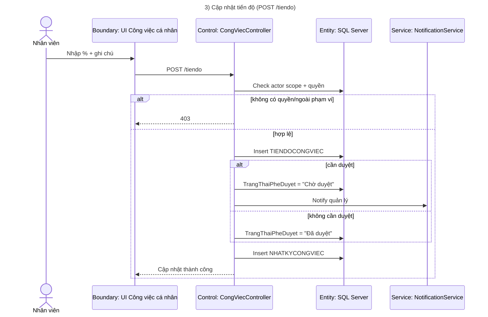
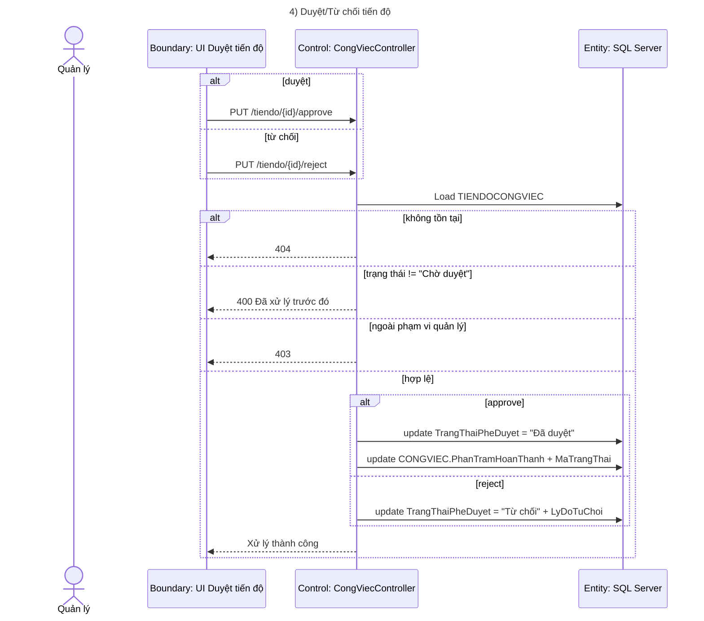
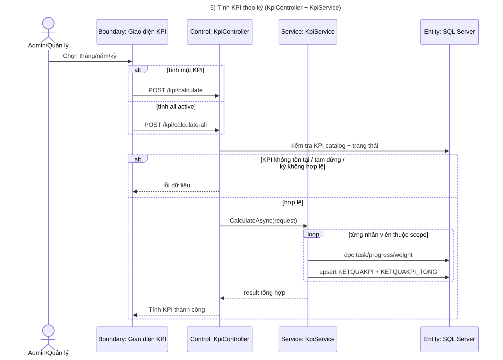
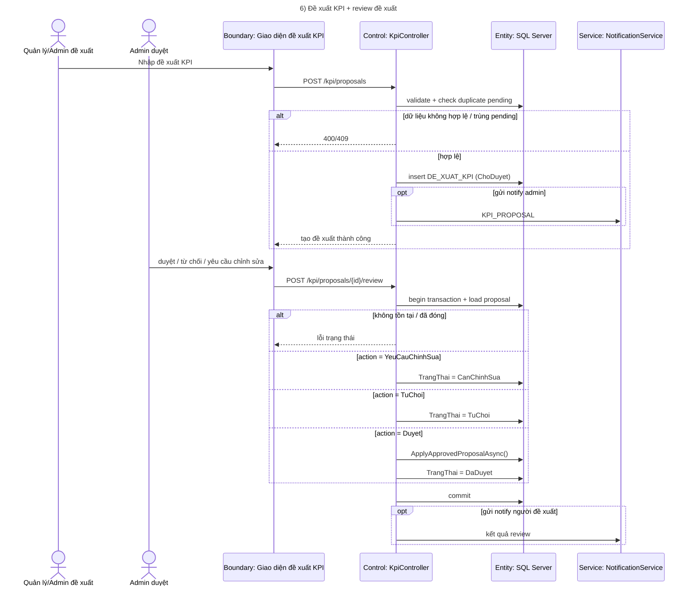
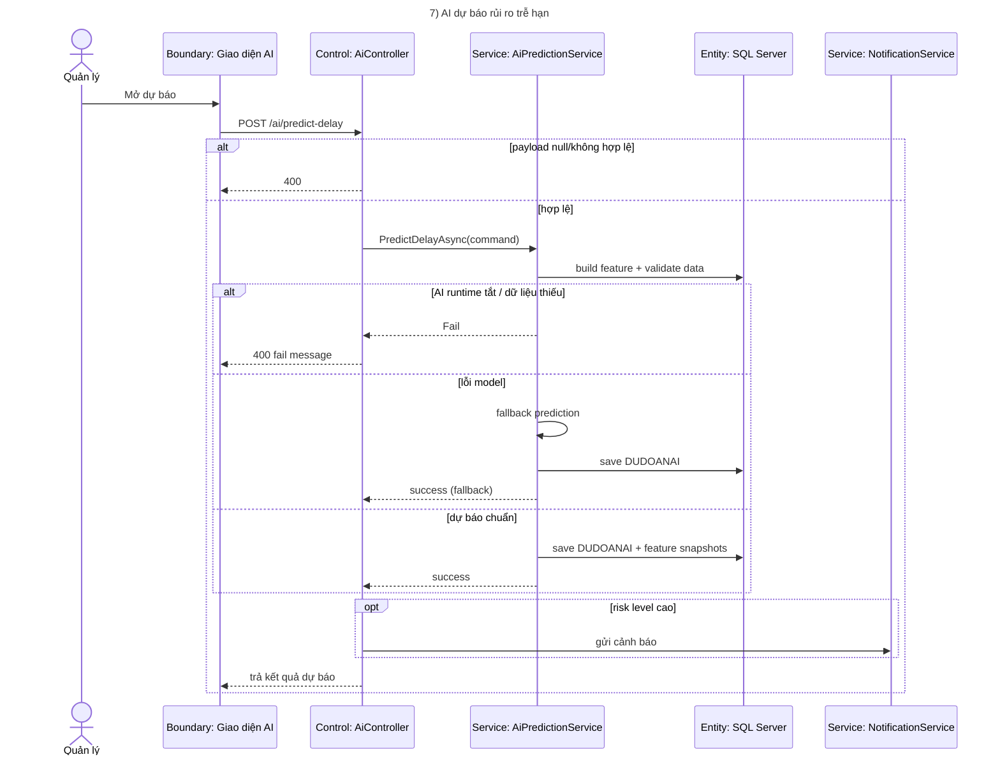
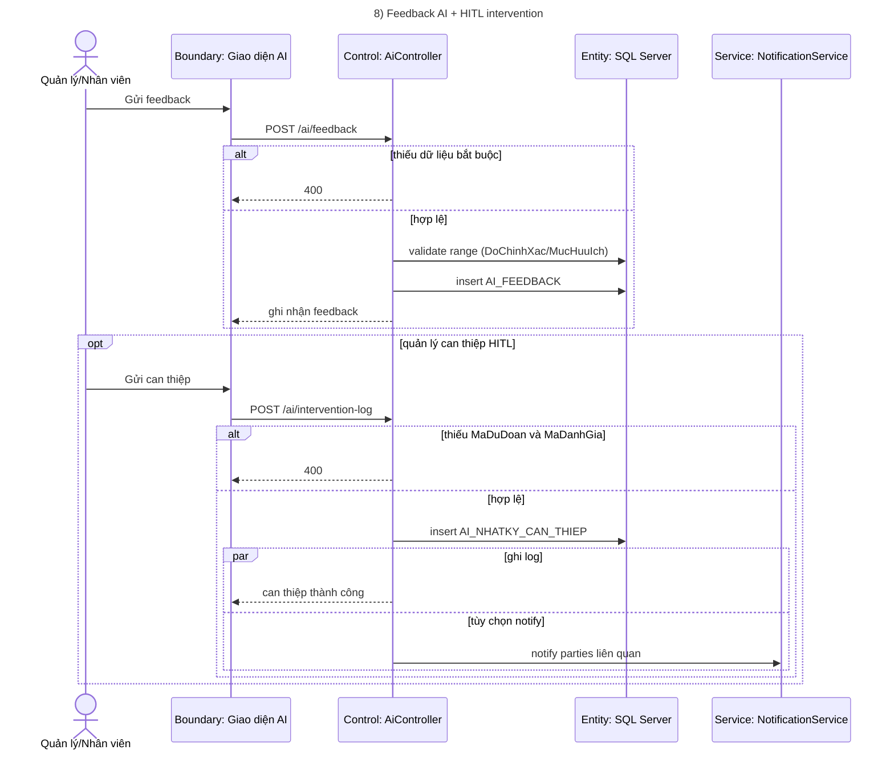
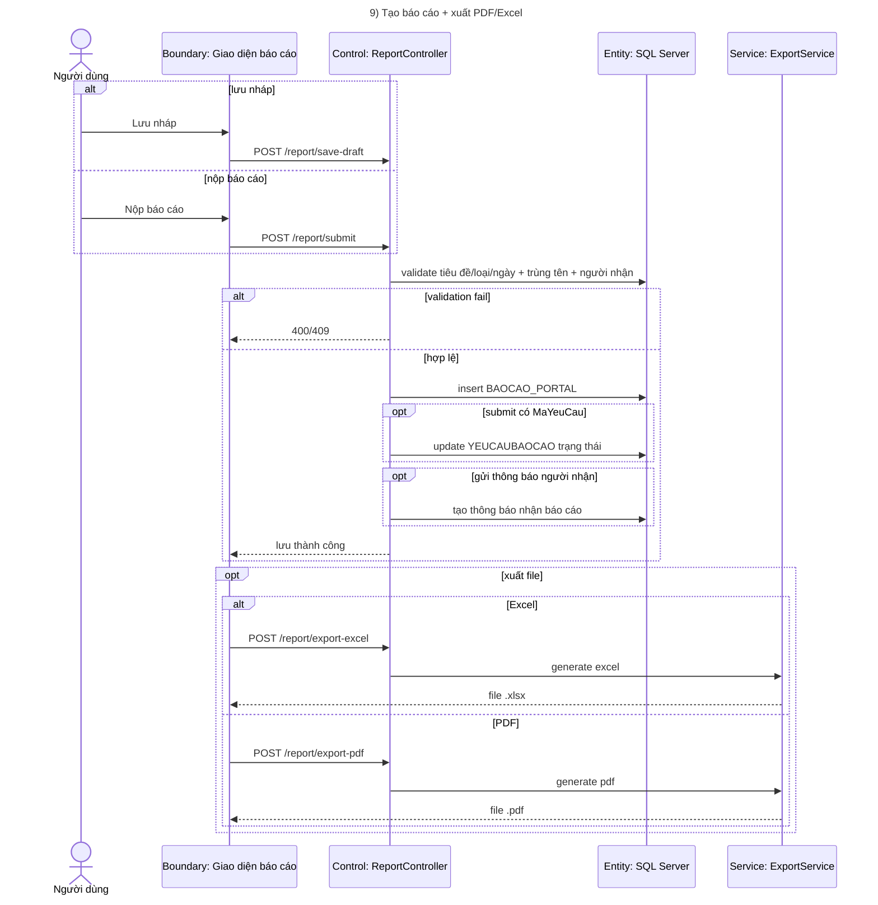
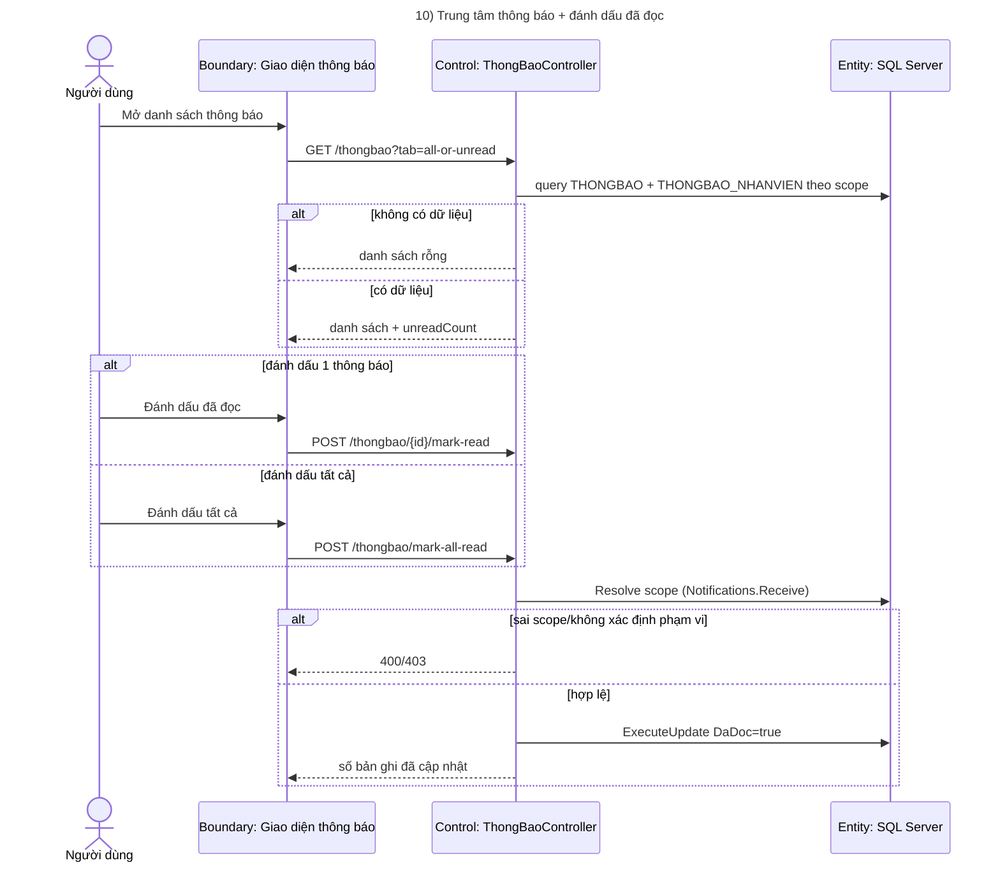

# Sequence Diagram Mermaid - LuanVan 2026

## 1) Đăng nhập (AccountController + Identity)

## 2) Tạo công việc + phân công (CongViecController)

## 3) Cập nhật tiến độ (POST /tiendo)

## 4) Duyệt/Từ chối tiến độ

## 5) Tính KPI theo kỳ (KpiController + KpiService)

## 6) Đề xuất KPI + review đề xuất

## 7) AI dự báo rủi ro trễ hạn

## 8) Feedback AI + HITL intervention

## 9) Tạo báo cáo + xuất PDF/Excel

## 10) Trung tâm thông báo + đánh dấu đã đọc

