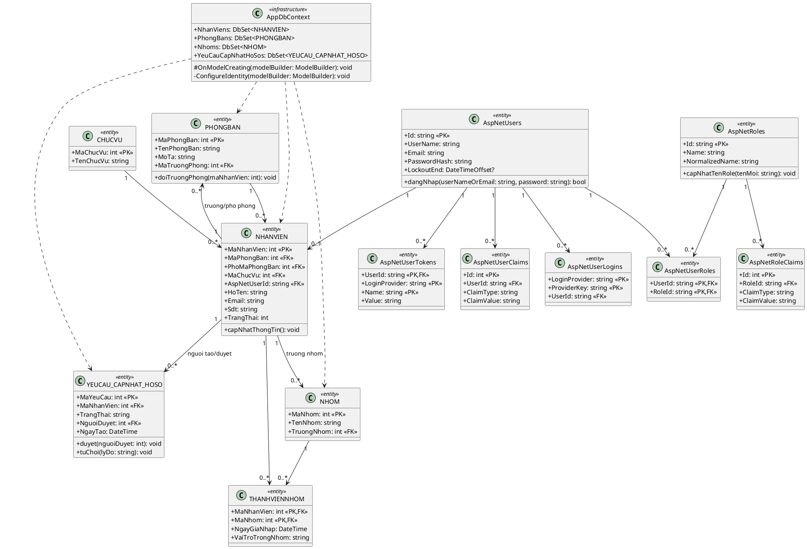
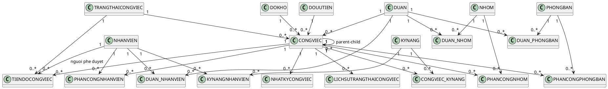
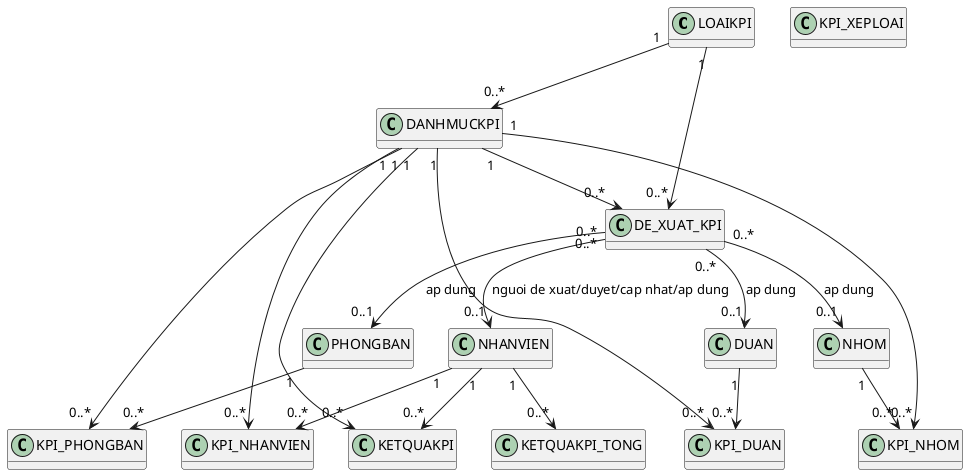
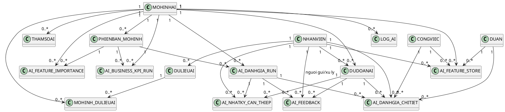
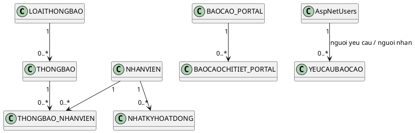
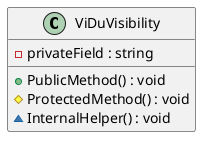

# So do lop (Class Diagram) - LV2026

Ban nhan xet dung: ban truoc bi rut gon qua nhieu. Theo `AppDbContext` hien tai co **48 DbSet**, cong them cac bang Identity (`AspNetUsers`, `AspNetRoles`, `AspNetUserRoles`, `AspNetUserClaims`, `AspNetRoleClaims`, `AspNetUserLogins`, `AspNetUserTokens`) thi tong so bang thuc te lon hon dang ke.

## 1) Ky hieu truy cap UML

- `+` : public / cong khai
- `-` : private / rieng tu
- `#` : protected / bao ve
- `~` : internal / noi bo

## 2) Vi sao thay nhieu dau `+`?

Dieu nay la dung voi code C# EF Core hien tai:
- Cac **entity model** (trong `Models`) gan nhu deu dung `public` property de EF map cot/bang.
- Vi vay tren class diagram cua **entity/database layer**, ky hieu `+` se chiem da so.
- Dau `-` va `#` xuat hien ro nhat o lop ha tang nhu `AppDbContext`:
  - `#OnModelCreating(...)`
  - `-ConfigureIdentity(...)`

## 3) So do class theo module (day du hon)

### 3.1 Identity + Nhan su

### 3.2 Du an - Cong viec - Phan cong

### 3.3 KPI

### 3.4 AI + Mo hinh

### 3.5 Thong bao - Bao cao - Nhat ky

## 4) Mau the hien co `+ - # ~` (vi du lop C#)

