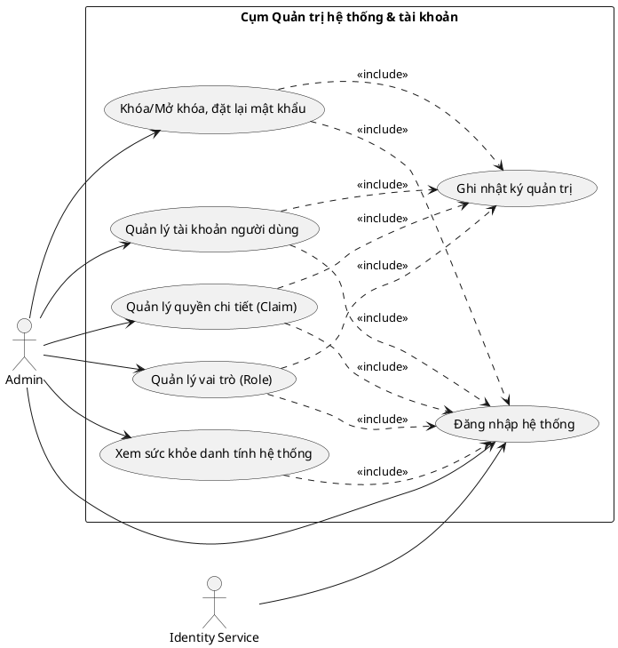
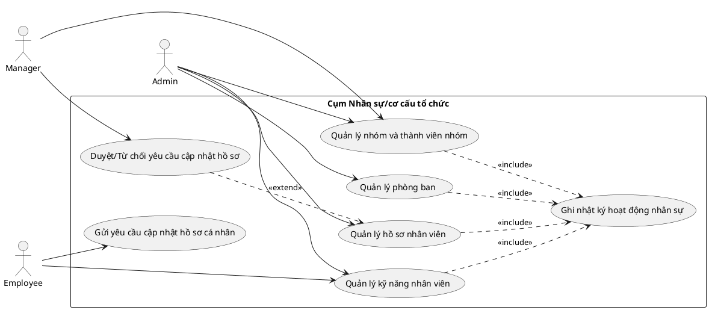
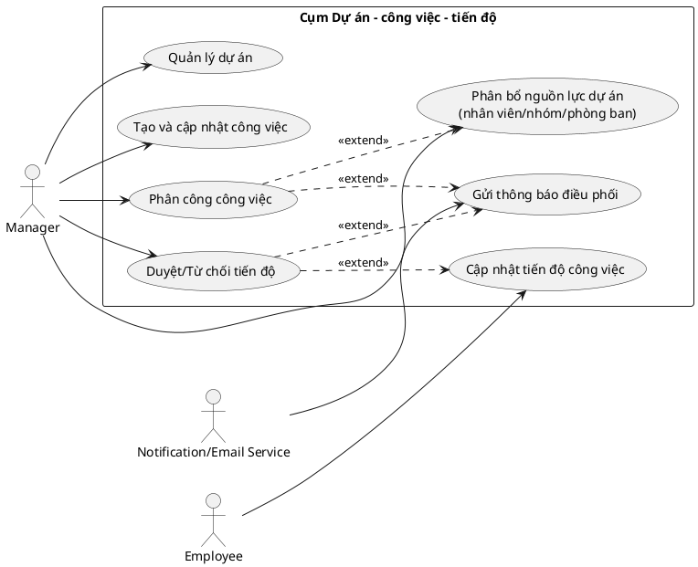
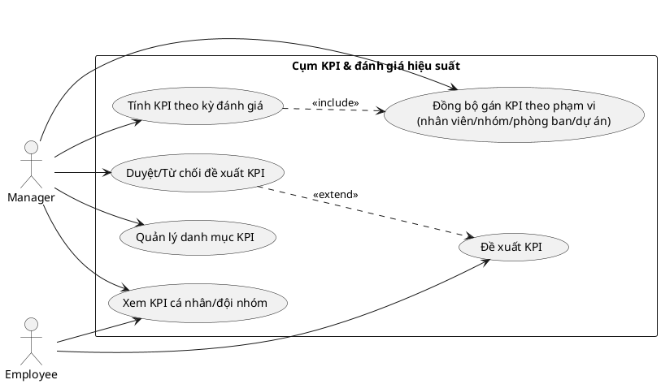
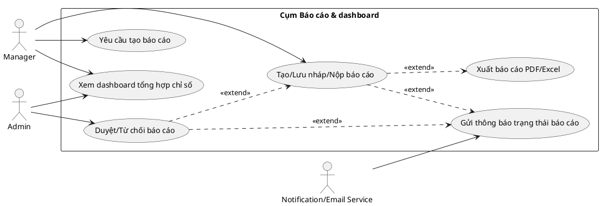
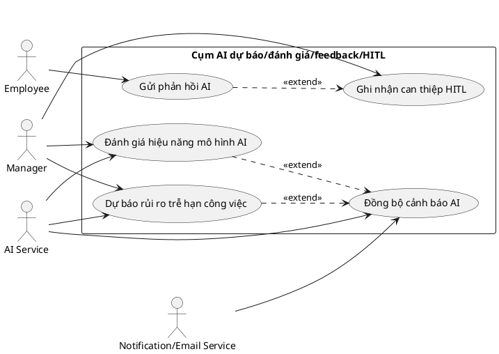

# Use Case Functional (Theo cụm chức năng)

## 1) Quản trị hệ thống & tài khoản

### Use case tiêu biểu: Quản lý tài khoản người dùng
- **Mục tiêu:** Tạo mới, cập nhật và liên kết tài khoản với nhân viên theo chính sách bảo mật.
- **Actor chính:** Admin.
- **Tiền điều kiện:** Admin đã xác thực thành công và có quyền quản trị tài khoản.
- **Hậu điều kiện:** Tài khoản được cập nhật hợp lệ; lịch sử thao tác được ghi nhận.
- **Luồng chính:** Mở danh sách tài khoản -> chọn tạo/cập nhật -> kiểm tra dữ liệu và ràng buộc -> lưu thay đổi -> phản hồi thành công.
- **Luồng thay thế/ngoại lệ:** Trùng username/email; nhân viên liên kết không hợp lệ; không đủ quyền thao tác.

---

## 2) Nhân sự/cơ cấu tổ chức

### Use case tiêu biểu: Duyệt/Từ chối yêu cầu cập nhật hồ sơ
- **Mục tiêu:** Bảo đảm thay đổi thông tin nhân sự được kiểm soát trước khi áp dụng chính thức.
- **Actor chính:** Manager (hoặc người có thẩm quyền duyệt).
- **Tiền điều kiện:** Có yêu cầu ở trạng thái chờ duyệt; actor có quyền phê duyệt.
- **Hậu điều kiện:** Yêu cầu chuyển trạng thái duyệt/từ chối; dữ liệu hồ sơ được cập nhật nếu duyệt.
- **Luồng chính:** Xem danh sách yêu cầu -> mở chi tiết thay đổi -> chọn duyệt -> ghi nhận quyết định -> cập nhật hồ sơ nhân viên.
- **Luồng thay thế/ngoại lệ:** Yêu cầu đã xử lý trước đó; dữ liệu đề xuất không hợp lệ; actor không thuộc phạm vi phê duyệt.

---

## 3) Dự án - công việc - tiến độ

### Use case tiêu biểu: Cập nhật tiến độ công việc
- **Mục tiêu:** Ghi nhận tiến độ thực hiện công việc, phục vụ giám sát và đánh giá hiệu suất.
- **Actor chính:** Employee.
- **Tiền điều kiện:** Employee đã được phân công công việc hợp lệ.
- **Hậu điều kiện:** Bản ghi tiến độ được lưu; trạng thái phê duyệt phản ánh đúng vòng đời.
- **Luồng chính:** Mở công việc được giao -> nhập tỷ lệ hoàn thành và ghi chú -> gửi cập nhật -> hệ thống lưu tiến độ chờ duyệt -> thông báo quản lý.
- **Luồng thay thế/ngoại lệ:** Công việc không còn hiệu lực; dữ liệu phần trăm không hợp lệ; không đúng người được phân công.

---

## 4) KPI & đánh giá hiệu suất

### Use case tiêu biểu: Tính KPI theo kỳ đánh giá
- **Mục tiêu:** Tính toán điểm KPI định kỳ dựa trên dữ liệu công việc và trọng số KPI đã cấu hình.
- **Actor chính:** Manager.
- **Tiền điều kiện:** Danh mục KPI và phạm vi áp dụng đã được cấu hình.
- **Hậu điều kiện:** Kết quả KPI kỳ đánh giá được lưu và có thể truy vấn báo cáo.
- **Luồng chính:** Chọn kỳ đánh giá -> chọn phạm vi tính -> hệ thống tổng hợp dữ liệu thực hiện -> tính điểm -> lưu kết quả và phản hồi.
- **Luồng thay thế/ngoại lệ:** Thiếu dữ liệu đầu vào; kỳ đánh giá không hợp lệ; cấu hình KPI chưa đầy đủ.

---

## 5) Báo cáo & dashboard

### Use case tiêu biểu: Tạo/Lưu nháp/Nộp báo cáo
- **Mục tiêu:** Chuẩn hóa quy trình lập báo cáo nghiệp vụ theo vòng đời bản nháp đến phê duyệt.
- **Actor chính:** Manager.
- **Tiền điều kiện:** Người dùng có quyền lập báo cáo và phạm vi dữ liệu hợp lệ.
- **Hậu điều kiện:** Báo cáo được lưu nháp hoặc chuyển trạng thái chờ duyệt.
- **Luồng chính:** Khởi tạo báo cáo -> nhập nội dung/chỉ số -> lưu nháp hoặc nộp -> hệ thống ghi nhận trạng thái mới.
- **Luồng thay thế/ngoại lệ:** Thiếu trường bắt buộc; kỳ dữ liệu không hợp lệ; quyền truy cập bị từ chối.

---

## 6) AI dự báo/đánh giá/feedback/HITL

### Use case tiêu biểu: Dự báo rủi ro trễ hạn công việc
- **Mục tiêu:** Cảnh báo sớm nguy cơ trễ hạn để hỗ trợ điều phối nguồn lực.
- **Actor chính:** Manager.
- **Tiền điều kiện:** Có dữ liệu công việc/tiến độ hợp lệ; dịch vụ AI khả dụng.
- **Hậu điều kiện:** Kết quả dự báo và mức rủi ro được lưu, có thể phát sinh cảnh báo.
- **Luồng chính:** Người dùng yêu cầu dự báo -> hệ thống chuẩn hóa dữ liệu đặc trưng -> gọi AI Service -> nhận kết quả xác suất/khuyến nghị -> lưu lịch sử dự báo.
- **Luồng thay thế/ngoại lệ:** Dịch vụ AI lỗi/timeout; dữ liệu đầu vào thiếu; mô hình chưa sẵn sàng.

