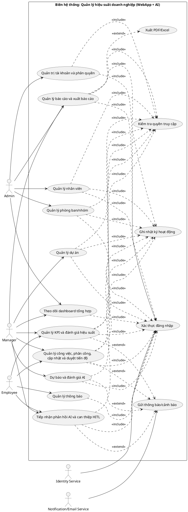

# Sơ Đồ Use Case Tổng Quát (WebApp + AI)

## Mục đích
Sơ đồ mô tả tổng quan các chức năng nghiệp vụ chính của hệ thống quản lý hiệu suất doanh nghiệp, trong phạm vi WebApp và mô-đun AI hỗ trợ ra quyết định.

## Sơ đồ Use Case tổng quát

## 1) Tác nhân trong hệ thống và ngoài hệ thống
- **Tác nhân người dùng nội bộ (trong phạm vi nghiệp vụ hệ thống):**
- `Admin` (Quản trị viên): quản trị tài khoản, phân quyền, quản trị nhân sự/tổ chức ở mức cao.
- `Manager` (Quản lý): điều phối dự án, công việc, KPI, báo cáo và sử dụng kết quả AI để ra quyết định.
- `Employee` (Nhân viên): cập nhật tiến độ, theo dõi KPI cá nhân, tiếp nhận/phan hồi thông báo và phản hồi AI.
- **Thành phần nội bộ của hệ thống (không phải tác nhân ngoài):**
- `AI Engine nội bộ` (qua `AiPredictionService`, `AiEvaluationService`): dự báo rủi ro, đánh giá mô hình, gợi ý nguồn lực và ghi nhận phản hồi/can thiệp.
- **Tác nhân hệ thống ngoài (external systems):**
- `Identity Service`: dịch vụ xác thực danh tính và cấp thông tin định danh/quyền.
- `Notification/Email Service`: dịch vụ gửi thông báo/cảnh báo ra ngoài ứng dụng.

## 2) Luồng liên kết tác nhân - chức năng (ai nối với cái nào)
- **Quản trị viên (`Admin`) liên kết với:**
- `Quản trị tài khoản và phân quyền`
- `Quản lý nhân viên`
- `Quản lý phòng ban/nhóm`
- `Quản lý báo cáo và xuất báo cáo`
- `Theo dõi dashboard tổng hợp`
- **Quản lý (`Manager`) liên kết với:**
- `Quản lý dự án`
- `Quản lý công việc, phân công, cập nhật và duyệt tiến độ`
- `Quản lý KPI và đánh giá hiệu suất`
- `Quản lý báo cáo và xuất báo cáo`
- `Theo dõi dashboard tổng hợp`
- `Dự báo và đánh giá AI`
- `Tiếp nhận phản hồi AI và can thiệp HITL`
- **Nhân viên (`Employee`) liên kết với:**
- `Quản lý công việc, phân công, cập nhật và duyệt tiến độ` (phần cập nhật cá nhân)
- `Quản lý KPI và đánh giá hiệu suất` (phần theo dõi cá nhân)
- `Quản lý thông báo`
- `Tiếp nhận phản hồi AI và can thiệp HITL` (phần phản hồi)
- **Hệ thống ngoài liên kết với:**
- `Identity Service` -> `Xác thực đăng nhập`
- `Notification/Email Service` -> `Gửi thông báo/cảnh báo`

## 3) Quan hệ include/extend trong sơ đồ
- `<<include>>` dùng cho chức năng bắt buộc:
- Hầu hết chức năng nghiệp vụ đều `include` `Xác thực đăng nhập`.
- Nhóm chức năng nhạy cảm dữ liệu `include` `Kiểm tra quyền truy cập`.
- Nhóm chức năng cập nhật dữ liệu `include` `Ghi nhật ký hoạt động`.
- `<<extend>>` dùng cho chức năng phát sinh theo điều kiện:
- `Quản lý báo cáo và xuất báo cáo` `extend` `Xuất PDF/Excel`.
- `Quản lý công việc`, `KPI`, `AI` có thể `extend` `Gửi thông báo/cảnh báo` khi có sự kiện cần phát thông tin.

## 4) Dữ liệu chính và đầu ra tổng quát
- **Dữ liệu chính:** tài khoản/role/claim, hồ sơ nhân viên, cơ cấu phòng ban-nhóm, dự án, công việc-tiến độ, danh mục và kết quả KPI, báo cáo, thông báo, dữ liệu dự báo/đánh giá/phản hồi AI.
- **Đầu ra:** nghiệp vụ được thực hiện đúng quyền; dữ liệu được cập nhật nhất quán; cung cấp dashboard, báo cáo, cảnh báo và insight AI phục vụ điều hành.

## 5) Lưu ý khi vẽ và trình bày trong luận văn
- Luôn thể hiện rõ **biên hệ thống** (system boundary) để phân biệt tác nhân ngoài hệ thống.
- Với module AI hiện tại triển khai trong code nội bộ, không bắt buộc vẽ actor ngoài cho AI; chỉ vẽ actor ngoài nếu AI được tách thành dịch vụ độc lập.
- Không nối trực tiếp actor tới use case quá chi tiết kỹ thuật (endpoint nhỏ); chỉ nối ở mức nghiệp vụ.
- Dùng `<<include>>` cho bước bắt buộc, dùng `<<extend>>` cho nhánh tùy chọn/phát sinh điều kiện.
- Tránh để một actor gắn chức năng vượt quyền nghiệp vụ (ví dụ Employee không gắn quản trị tài khoản).
- Giữ tên use case thống nhất động từ + đối tượng nghiệp vụ, ví dụ: `Quản lý dự án`, `Tính KPI theo kỳ`.
- Khi render PlantUML, nên dùng alias không dấu (như trong file) để tránh lỗi font/ký tự.
